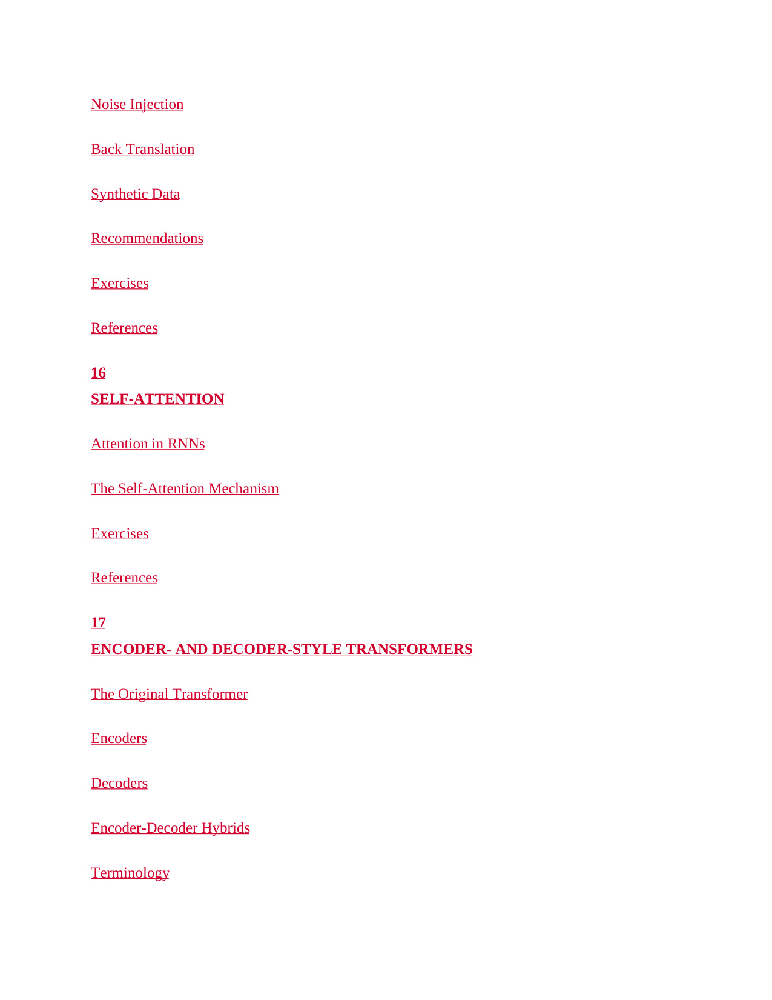

 | [[page_017|« 上一页]] | [[../README|📖 回到书页]] | [[page_019|下一页 »]]
# 第 18 页

我来帮你把图片里的所有术语，按章节做完整翻译和解释，方便你复习：

---

### 1. Noise Injection
**噪声注入**
文本数据增强方法，在输入中人为添加微小扰动（如错别字、字符替换、随机掩码），提升模型的鲁棒性与泛化能力。

### 2. Back Translation
**回译 / 反向翻译**
经典文本数据增强方法：先把文本翻译成另一门语言，再译回原语言，得到语义相近、表达不同的新样本，用于扩充训练数据。

### 3. Synthetic Data
**合成数据**
由模型自动生成、而非人工采集标注的全新数据样本，常用于解决真实数据不足、标注成本高的问题。

### 4. Recommendations
**建议/推荐**
章节末尾给出的实践建议、优化方案或最佳实践指南。

### 5. Exercises
**习题**
章节配套练习题，用于巩固知识点。

### 6. References
**参考文献**
章节引用的文献、论文、资料列表。

---

## 第16章 SELF-ATTENTION
### SELF-ATTENTION
**自注意力机制**
Transformer的核心组件，让序列中的每个元素都与序列中所有元素计算关联权重，直接建模长距离依赖关系。

### 1. Attention in RNNs
**循环神经网络中的注意力**
早期RNN/Seq2Seq模型中使用的注意力机制，主要是编码器-解码器之间的交叉注意力，只能建模有限的依赖关系，且受串行计算限制。

### 2. The Self-Attention Mechanism
**自注意力机制原理**
解释自注意力的核心计算逻辑：Query/Key/Value的权重计算、多头注意力、掩码等核心概念。

### （配套）Exercises / References
同前，是本章的习题和参考文献。

---

## 第17章 ENCODER- AND DECODER-STYLE TRANSFORMERS
### ENCODER- AND DECODER-STYLE TRANSFORMERS
**编码器与解码器架构Transformer**
对Transformer不同结构变体的分类与讲解。

### 1. The Original Transformer
**原始标准版Transformer**
2017年《Attention Is All You Need》论文提出的完整结构，包含编码器+解码器，最初用于机器翻译任务。

### 2. Encoders
**纯编码器架构**
只堆叠编码器层，使用双向自注意力，侧重语义理解，代表模型如BERT，适合分类、语义匹配等任务。

### 3. Decoders
**纯解码器架构**
只堆叠解码器层，使用掩码自注意力，侧重自回归生成，代表模型如GPT系列，适合文本续写、对话等生成任务。

### 4. Encoder-Decoder Hybrids
**编码器-解码器混合架构**
同时包含编码器和解码器，兼顾理解与生成，代表模型如T5、BART，适合翻译、摘要等序列到序列任务。

### 5. Terminology
**术语释义**
本章相关的关键术语定义与说明。

---

如果你需要，我可以帮你把这些术语整理成一份**中英对照的背诵清单**，方便你考前快速复习。

---

 | [[page_017|« 上一页]] | [[../README|📖 回到书页]] | [[page_019|下一页 »]]
