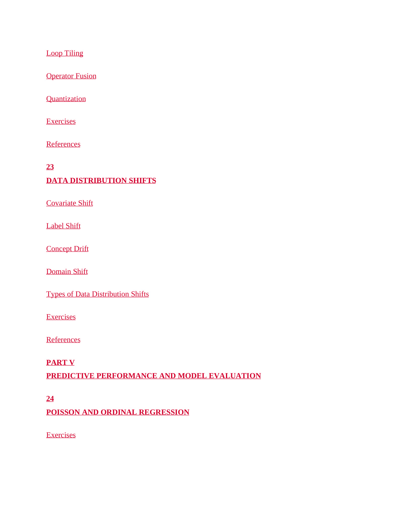

# 第 21 页

---

 | [[page_020|« 上一页]] | [[../README|📖 回到书页]] | [[page_022|下一页 »]]

### Loop Tiling
**循环分块 / 循环平铺**
一种底层性能优化技术，把大循环拆分成适配CPU缓存大小的小块，减少内存读写次数，提升推理速度。

### Operator Fusion
**算子融合**
将多个连续的运算算子（如矩阵乘法+偏置+激活）合并成一个，省去中间结果的读写开销，降低显存占用、提升计算效率。

### Quantization
**量化**
模型压缩与推理加速的核心方法，把模型参数从高精度（如FP32）转为低精度（如FP16/INT8），在损失少量精度的前提下，大幅降低显存占用并提速。

---

## 第23章 DATA DISTRIBUTION SHIFTS
### DATA DISTRIBUTION SHIFTS
**数据分布偏移**
指模型训练数据与实际测试数据的分布不一致，导致模型泛化性能下降的现象。

### Covariate Shift
**协变量偏移**
最常见的分布偏移：输入特征的分布发生变化，但特征与标签的映射关系保持不变。

### Label Shift
**标签偏移**
标签类别的分布发生变化，但特征与标签的对应关系不变。例如训练数据中“猫”占比高，测试数据中“狗”占比高。

### Concept Drift
**概念漂移**
特征与标签之间的关联关系本身发生变化。例如用户的兴趣随时间改变，导致推荐模型效果下降。

### Domain Shift
**域偏移**
数据所属的场景/领域发生整体变更。例如模型在“实验室拍摄的照片”上训练，却要处理“手机拍摄的模糊照片”。

### Types of Data Distribution Shifts
**数据分布偏移的类型**
对以上各类偏移的系统性分类与讲解。

### Exercises / References
本章配套的练习题和参考文献。

---

## PART V PREDICTIVE PERFORMANCE AND MODEL EVALUATION
**第五部分：预测性能与模型评估**
全书的一个大章节模块，聚焦模型效果的评估方法与不确定性分析。

---

## 第24章 POISSON AND ORDINAL REGRESSION
### POISSON AND ORDINAL REGRESSION
**泊松回归与序数回归**
针对特殊类型因变量的回归分析方法。

### Poisson Regression
**泊松回归**
用于建模计数型离散数据（如事件发生次数、访问量）的回归模型，假设因变量服从泊松分布。

### Ordinal Regression
**序数回归**
用于建模有序分类数据（如评分、等级、满意度）的回归模型，保留了类别之间的顺序关系。

### Exercises
本章配套练习题。

---
