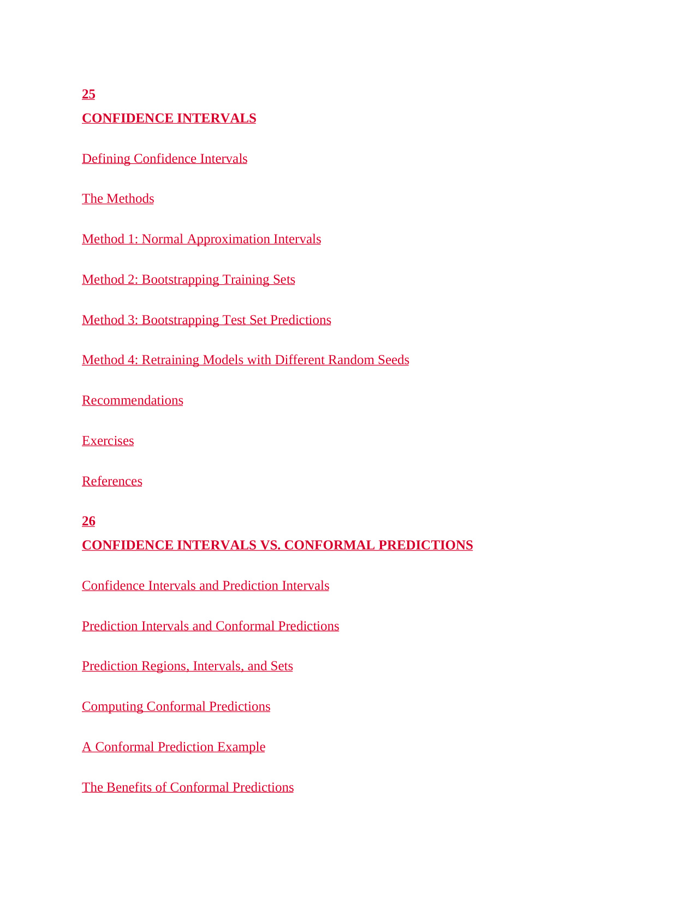

# 第 22 页

---

 | [[page_021|« 上一页]] | [[../README|📖 回到书页]] | [[page_023|下一页 »]]

---

## 第25章 CONFIDENCE INTERVALS
**置信区间**
用于量化模型预测结果或统计量的不确定性，给出真实值大概率落在的数值范围。

- **Defining Confidence Intervals**：置信区间的定义
  解释置信区间的统计学含义，如“95%置信水平”代表的意义。

- **The Methods**：计算方法
  介绍构建置信区间的不同技术路径。

- **Method 1: Normal Approximation Intervals**：正态近似区间法
  假设统计量服从正态分布，用均值和标准差估算区间，计算简便。

- **Method 2: Bootstrapping Training Sets**：训练集自助抽样法
  通过对训练数据有放回重采样，训练多个模型，由结果波动生成区间。

- **Method 3: Bootstrapping Test Set Predictions**：测试集预测结果自助抽样法
  对模型在测试集上的预测值进行反复抽样，评估预测结果的波动范围。

- **Method 4: Retraining Models with Different Random Seeds**：多随机种子重训练法
  固定数据、更换初始化种子多次训练，由模型性能差异确定区间边界。

- **Recommendations**：建议
  章节给出的实践建议与最佳使用场景。
- **Exercises / References**：习题与参考文献

---

## 第26章 CONFIDENCE INTERVALS VS. CONFORMAL PREDICTIONS
**置信区间与保形预测对比**
对比两种量化预测不确定性的主流方法。

- **Confidence Intervals and Prediction Intervals**：置信区间与预测区间
  区分“估计总体参数的置信区间”和“估计单个未来观测值的预测区间”。

- **Prediction Intervals and Conformal Predictions**：预测区间与保形预测
  引入保形预测（Conformal Predictions）的概念，它无需假设数据分布，就能保证预测结果的覆盖率。

- **Prediction Regions, Intervals, and Sets**：预测区域、区间与集合
  介绍保形预测的不同形式，包括区间、集合等。

- **Computing Conformal Predictions**：保形预测的计算方法
  讲解如何通过分位数校准等步骤，生成满足覆盖率保证的预测区间。

- **A Conformal Prediction Example**：保形预测示例
  通过具体案例演示保形预测的实现过程与效果。

- **The Benefits of Conformal Predictions**：保形预测的优势
  对比传统置信区间，说明保形预测在分布假设、覆盖率保证和鲁棒性上的优势。

---
