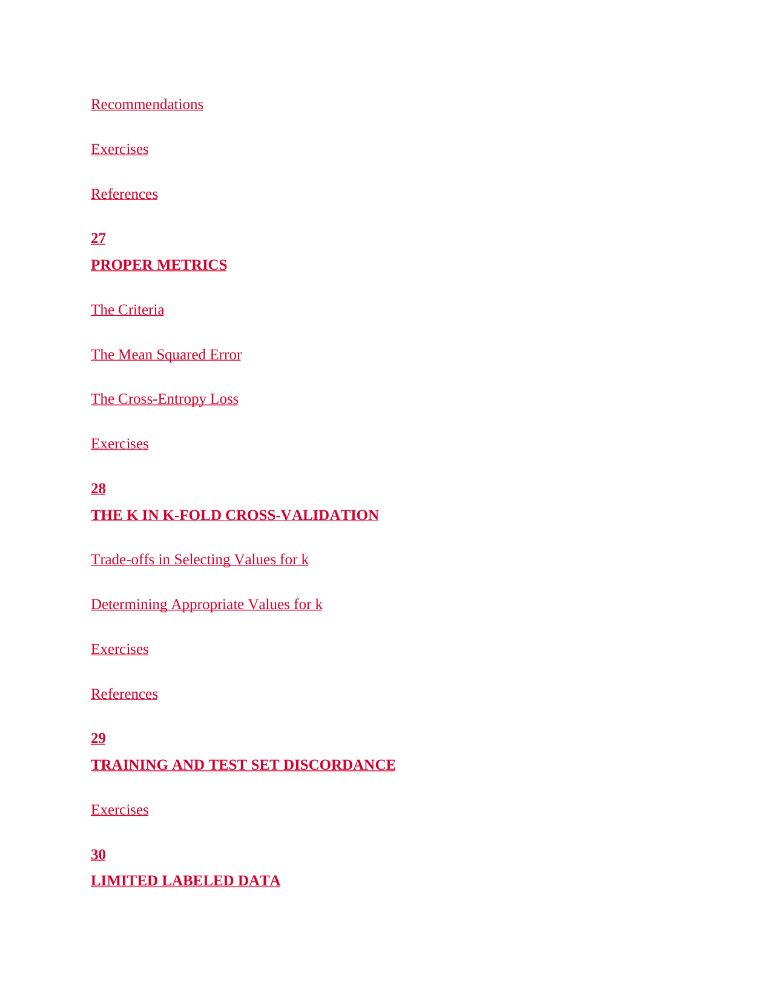

# 第 23 页

---

 | [[page_022|« 上一页]] | [[../README|📖 回到书页]] | [[page_024|下一页 »]]

## 第27章 PROPER METRICS
**合适的评估指标**
讲解机器学习中“合理”的模型评估指标应满足的条件，以及常用的典型指标。

- **The Criteria**：评估指标的标准
  介绍一个好的评估指标需要满足的特性，比如对误差的敏感度、单调性、可解释性等。

- **The Mean Squared Error**：均方误差（MSE）
  回归任务最常用的损失/指标之一，计算预测值与真实值差的平方的平均值，侧重惩罚大误差。

- **The Cross-Entropy Loss**：交叉熵损失
  分类任务的核心损失函数，衡量模型预测概率分布与真实分布的差异，常用于训练分类器。

- **Exercises**：本章配套习题

---

## 第28章 THE K IN K-FOLD CROSS-VALIDATION
**K折交叉验证中的K值选择**
讲解交叉验证中关键参数K的选择逻辑。

- **Trade-offs in Selecting Values for k**：K值选择的权衡
  讨论K取不同值时的利弊：K越大，训练集越接近全量数据，方差低但计算成本高；K越小，计算快但偏差大。

- **Determining Appropriate Values for k**：确定合适的K值
  介绍如何根据数据规模、计算资源、偏差方差需求，选择合适的K值（如常见的K=5或10）。

- **Exercises / References**：本章习题与参考文献

---

## 第29章 TRAINING AND TEST SET DISCORDANCE
**训练集与测试集不一致问题**
指训练数据与测试数据的分布存在差异（即数据分布偏移），导致模型泛化能力下降的现象。

- **Exercises**：本章配套习题

---

## 第30章 LIMITED LABELED DATA
**有限标注数据场景**
讲解在标注数据稀缺时，如何训练和评估模型的方法，比如半监督学习、自监督预训练、主动学习、数据增强等。

---

如果你需要，我可以帮你把这些评估指标和交叉验证的核心要点整理成一份**速记清单**，方便你考前快速复习。