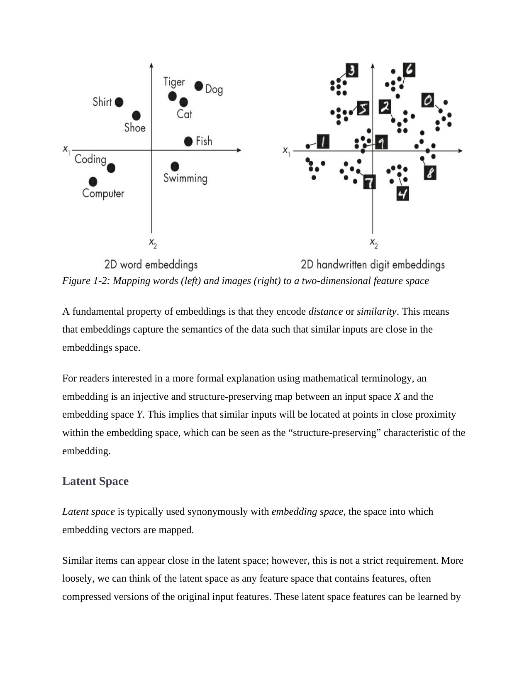

# 第 38 页

---

 | [[page_037|« 上一页]] | [[../README|📖 回到书页]] | [[page_039|下一页 »]]

---

**Figure 1-2: Mapping words (left) and images (right) to a two-dimensional feature space**  
图1-2：将单词（左）和图像（右）映射到二维特征空间

> 🔍 **说明**：  
> 左图是词嵌入（如“Dog”、“Cat”等动物类词聚在一起），右图是手写数字的嵌入（如“0”、“1”等数字各自成簇）。两者都展示了相似项在嵌入空间中彼此靠近。

---

A fundamental property of embeddings is that they encode distance or similarity.  
嵌入的一个基本性质是它们编码了距离或相似性。

> ✅ 解释：  
> 嵌入向量之间的几何距离反映了原始数据的语义相似度。例如，“cat” 和 “dog” 在嵌入空间中很近，因为它们都是动物。

---

This means that embeddings capture the **semantics of the data** such that similar inputs are close in the embeddings space.  
这意味着嵌入捕捉了数据的语义信息( semantics of the data)，使得相似的输入在嵌入空间中彼此接近。

> 💡 举个例子：  
> “swimming” 和 “fish” 可能在同一区域，因为它们常出现在相同上下文中；而 “computer” 和 “coding” 更接近，属于技术领域。

---

For readers interested in a more formal explanation using mathematical terminology, an embedding is an injective and structure-preserving map between an input space X and the embedding space Y. 
![[Vox_1780153395989.wav]]
对于希望用数学术语获得更正式解释的读者，嵌入是从输入空间 X 到嵌入空间 Y 的一个单射且保持结构的映射。

> 📚 数学术语解析：
> 
> - **injective（单射）**：不同的输入对应不同的输出（无重复）
> - **structure-preserving（保持结构）**：相似的输入在嵌入空间中仍然相似
> - 即：嵌入是一种“保结构”的变换

---

This implies that similar inputs will be located at points in close proximity within the embedding space, which can be seen as the “structure-preserving” characteristic of the embedding.  
这表明相似的输入会在嵌入空间中位于相近的位置，这正是嵌入的“保持结构”特性。

> 🔁 简单说：  
> 如果两个词意思相近，它们的嵌入向量也会在空间中靠得近。

---

### Latent Space

潜在空间

> 🟩 小标题，进入新主题。

---

Latent space is typically used synonymously with embedding space, the space into which embedding vectors are mapped.  
潜在空间通常与嵌入空间同义，即嵌入向量被映射到的空间。

> ✅ 说明：  
> “latent space” 和 “embedding space” 常互换使用，指模型内部表示数据的低维空间。

---

Similar items can appear close in the latent space; however, this is not a strict requirement.  
相似的项目可以在潜在空间中彼此靠近；但这一点并非严格要求。

> ⚠️ 注意：  
> 虽然理想情况下相似项应靠近，但在某些模型中（如随机初始化阶段）可能不成立。

---

More loosely, we can think of the latent space as any feature space that contains features, often compressed versions of the original input features.  
更宽松地说，我们可以把潜在空间看作任何包含特征的特征空间，通常是原始输入特征的压缩版本。

> 💡 例如：
> 
> - 图像经过CNN后提取的特征图 → 是原始像素的压缩表示
> - 文本经过Transformer后的隐藏状态 → 是词汇序列的抽象表示

---

These latent space features can be learned by  
这些潜在空间特征可以通过……

> ❌ 此处句子未完整，可能是下一页继续。推测接下来会讲如何通过训练学习这些特征（如反向传播、自编码器等）。

---

✅ **总结关键点**：

|概念|含义|
|---|---|
|**Embedding**|将高维稀疏数据（如单词、图像）映射为低维稠密向量|
|**Embedding Space**|所有嵌入向量所在的向量空间|
|**Latent Space**|与嵌入空间类似，常用于生成模型（如VAE、GAN）中|
|**Distance in Embedding Space**|反映语义相似性（越近越相似）|

 | [[page_037|« 上一页]] | [[../README|📖 回到书页]] | [[page_039|下一页 »]]