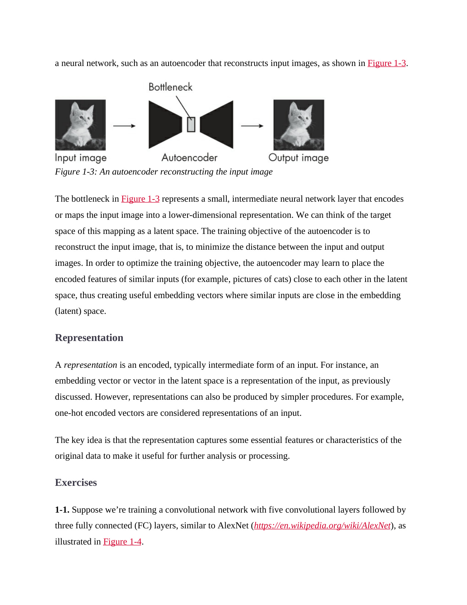

# 第 39 页
 | [[page_038|« 上一页]] | [[../README|📖 回到书页]] | [[page_040|下一页 »]]

a neural network, such as an autoencoder that reconstructs input images, as shown in Figure 1-3.  
一个神经网络，例如能够重建输入图像的自编码器，如图1-3所示。

> 🔍 **说明**：  
> 这句话承接前文，说明潜在空间特征可以通过像“自编码器”这样的神经网络学习得到。

---

Figure 1-3: An autoencoder reconstructing the input image  
图1-3：自编码器重建输入图像

> 📌 **图示说明**：  
> 左侧是输入图像（一只猫），中间是自编码器结构（类似沙漏形状），右侧是输出图像（重建后的猫）。中间的窄层称为“瓶颈层”。

---

The bottleneck in Figure 1-3 represents a small, intermediate neural network layer that encodes or maps the input image into a lower-dimensional representation.  
图1-3中的瓶颈层代表一个较小的中间神经网络层，它将输入图像编码或映射为低维表示。

> ✅ 解释：  
> “瓶颈”（bottleneck）是自编码器中维度最小的一层，负责压缩信息。它是从原始高维数据到低维嵌入的关键步骤。

---

We can think of the target space of this mapping as a latent space.  
我们可以将这种映射的目标空间视为潜在空间。

> 💡 意思是：  
> 瓶颈层输出的向量所在的空间就是**潜在空间（latent space）**，也叫**嵌入空间（embedding space）**。

---

The training objective of the autoencoder is to reconstruct the input image, that is, to minimize the distance between the input and output images.  
自编码器的训练目标是重建输入图像，即最小化输入图像与输出图像之间的距离。

> 🔁 目标函数通常用均方误差（MSE）衡量：  
> `loss = ||input_image - output_image||²`

---

In order to optimize the training objective, the autoencoder may learn to place the encoded features of similar inputs (for example, pictures of cats) close to each other in the latent space, thus creating useful embedding vectors where similar inputs are close in the embedding (latent) space.  
为了优化训练目标，自编码器可能会学习将相似输入（例如猫的照片）的编码特征在潜在空间中彼此靠近，从而生成有用的嵌入向量，使得相似输入在嵌入（潜在）空间中彼此接近。

![[Vox_1780213297618.wav]]

> 🧠 关键洞察：  
> 即使没有标签，自编码器也能通过“重建任务”学到语义结构——比如所有猫的图像在潜在空间中聚成一类。

---

### Representation

表示

> 🟩 小标题，进入新主题。

---

A representation is an encoded, typically intermediate form of an input.  
表示是一种编码后的、通常是中间形式的输入。

> ✅ 例如：
> 
> - 图像经过CNN后提取的特征图
> - 文本经过词嵌入层后的向量
> - 自编码器瓶颈层的输出

---

For instance, an embedding vector or vector in the latent space is a representation of the input, as previously discussed.  
例如，嵌入向量或潜在空间中的向量就是输入的一种表示，正如之前讨论的那样。

> 🔁 回顾：嵌入和潜在空间中的向量都是“representation”的具体形式。

---

However, representations can also be produced by simpler procedures. For example, one-hot encoded vectors are considered representations of an input.  
然而，表示也可以由更简单的程序生成。例如，独热编码向量被认为是输入的一种表示。

> ⚠️ 注意：虽然独热编码不是“智能”的表示，但它仍然是对原始输入的编码形式，因此也算一种**representation**。

---

The key idea is that the representation captures some essential features or characteristics of the original data to make it useful for further analysis or processing.  
核心思想是：表示捕捉了原始数据的一些关键特征或特性，使其可用于进一步分析或处理。

![[Vox_1780224529302.wav]]

> ✅ 总结：  
> 无论是复杂的嵌入还是简单的独热编码，只要能保留有用信息，就属于“representation”。

---

### Exercises

练习题

> 📝 开始习题部分。

---

1-1. Suppose we’re training a convolutional network with five convolutional layers followed by three fully connected (FC) layers, similar to AlexNet ([https://en.wikipedia.org/wiki/AlexNet](https://en.wikipedia.org/wiki/AlexNet)), as illustrated in Figure 1-4.  
1-1. 假设我们正在训练一个卷积网络，包含五个卷积层，后面跟着三个全连接（FC）层，类似于AlexNet（[https://en.wikipedia.org/wiki/AlexNet），如图1-4所示。](https://en.wikipedia.org/wiki/AlexNet%EF%BC%89%EF%BC%8C%E5%A6%82%E5%9B%BE1-4%E6%89%80%E7%A4%BA%E3%80%82)

> 🔍 **说明**：  
> 这是一个典型的深度卷积神经网络结构。图1-4未显示，但通常会展示各层如何逐步提取特征。

---

✅ **总结关键点**：

|概念|含义|
|---|---|
|**Autoencoder（自编码器）**|一种无监督学习模型，目标是重建输入|
|**Bottleneck（瓶颈层）**|中间最窄的层，负责压缩信息 → 形成潜在表示|
|**Latent Space / Embedding Space**|瓶颈层输出的低维空间，相似样本在此聚集|
|**Representation（表示）**|输入的任何编码形式，包括嵌入、特征图、独热编码等|

---

如果您需要我继续翻译图1-4的内容或解答练习题，请提供后续文本！

---

 | [[page_038|« 上一页]] | [[../README|📖 回到书页]] | [[page_040|下一页 »]]
