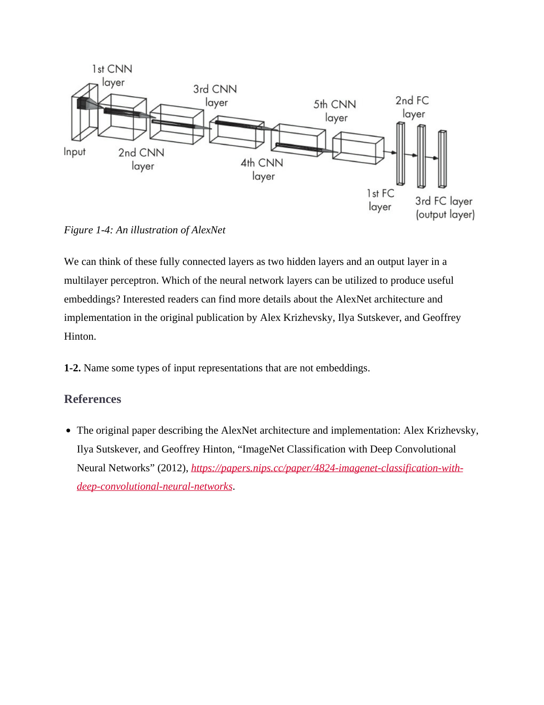

# 第 40 页

---

 | [[page_039|« 上一页]] | [[../README|📖 回到书页]] | [[page_041|下一页 »]]
![[1780237895911.wav]]以下是您提供的英文内容的**逐句解析与翻译**（一行英文，一行中文），并附有详细解释和背景知识说明，帮助你深入理解 AlexNet 架构及其相关概念。

---

### 🔹 图 1-4：AlexNet 的结构图

> **Figure 1-4: An illustration of AlexNet**  
> 图1-4：AlexNet 的示意图

> 📌 **图示说明**：
> - 输入图像 → 经过 5 个卷积层（CNN layers）→ 3 个全连接层（FC layers）
> - 最后一个 FC 层是输出层（用于分类）
> - 这是深度学习史上第一个在 ImageNet 上取得突破性成果的 CNN 模型（2012年）

---

We can think of these fully connected layers as two hidden layers and an output layer in a multilayer perceptron.  
我们可以将这些全连接层视为多层感知机中的两个隐藏层和一个输出层。

> ✅ 解释：
> - 多层感知机（MLP）是传统神经网络的基本结构。
> - 在 AlexNet 中，最后三个全连接层的作用类似于 MLP，负责从特征中提取高层语义信息并进行分类。
> - 其中前两个是“隐藏层”，最后一个为“输出层”。

---

Which of the neural network layers can be utilized to produce useful embeddings?  
哪些神经网络层可以用来生成有用的嵌入向量？

> ❓ 这是一个开放性问题，引导读者思考：
> - 哪些层的输出能作为**有意义的表示**？
> - 答案通常是：**倒数第二层或倒数第三层的输出**（即“瓶颈层”）。
> - 因为它们已经提取了丰富的语义特征，但还未被压缩成最终类别概率。

> 💡 小技巧：在实际应用中，常把“倒数第二层”作为**特征提取器**（feature extractor），用于迁移学习或聚类。

---

Interested readers can find more details about the AlexNet architecture and implementation in the original publication by Alex Krizhevsky, Ilya Sutskever, and Geoffrey Hinton.  
感兴趣的读者可以在 Alex Krizhevsky、Ilya Sutskever 和 Geoffrey Hinton 的原始论文中找到关于 AlexNet 架构和实现的更多细节。

> 📚 背景知识：
> - 这三位是深度学习奠基人之一。
> - 该论文发表于 NIPS 2012，标题为：“ImageNet Classification with Deep Convolutional Neural Networks”。
> - 它首次证明了深度 CNN 在大规模图像识别任务上的强大能力，推动了深度学习的复兴。

---

### 1-2. Name some types of input representations that are not embeddings.  
1-2. 列举一些不属于嵌入的输入表示类型。

> 🧩 这是一道练习题，考察对“representation”和“embedding”的区分。

#### ✅ 可能的答案包括：
| 表示类型 | 是否属于 embedding？ | 说明 |
|--------|------------------|------|
| **One-hot encoding** | ❌ 不是 | 是稀疏的、固定的编码方式，不包含语义关系 |
| **Raw pixel values** | ❌ 不是 | 图像的原始像素值，未经过任何变换 |
| **Bag-of-words (BoW)** | ❌ 不是 | 文本的词频统计，无顺序和语义结构 |
| **TF-IDF vectors** | ❌ 不是 | 基于词频的权重向量，仍属浅层表示 |

> ✅ 总结：  
> **Embedding 是一种“可学习的、稠密的、语义敏感的表示”**，而上述方法通常是静态的、稀疏的或低级的。

---

### References  
参考文献

> ⬇️ 下面列出的是该章节引用的原始论文。

---

• The original paper describing the AlexNet architecture and implementation: Alex Krizhevsky, Ilya Sutskever, and Geoffrey Hinton, “ImageNet Classification with Deep Convolutional Neural Networks” (2012), https://papers.nips.cc/paper/4824-imagenet-classification-with-deep-convolutional-neural-networks.

> 📝 **关键信息解析**：
> - **作者**：Alex Krizhevsky（提出者）、Ilya Sutskever、Geoffrey Hinton（深度学习之父）
> - **发表时间**：2012 年
> - **会议**：NIPS（NeurIPS）——人工智能顶级会议
> - **贡献**：
>   - 首次使用 GPU 训练大型 CNN
>   - 引入 ReLU 激活函数、Dropout 正则化等技术
>   - 在 ImageNet 竞赛中大幅领先传统方法，引发深度学习热潮

> 🔗 链接地址：https://papers.nips.cc/paper/4824-imagenet-classification-with-deep-convolutional-neural-networks  
> 👉 推荐阅读！这是深度学习史上的里程碑论文。

---

### ✅ 总结要点

| 概念 | 内容 |
|------|------|
| **AlexNet 结构** | 5 个卷积层 + 3 个全连接层，开创现代 CNN 先河 |
| **全连接层作用** | 类似 MLP，用于高层特征整合和分类 |
| **有用嵌入来自哪里？** | 通常取自倒数第二层（如第2个FC层） |
| **非嵌入表示例子** | One-hot、原始像素、BoW、TF-IDF 等 |
| **经典论文** | Krizhevsky et al., 2012 —— 深度学习革命起点 |

---

| [[page_039|« 上一页]] | [[../README|📖 回到书页]] | [[page_041|下一页 »]]