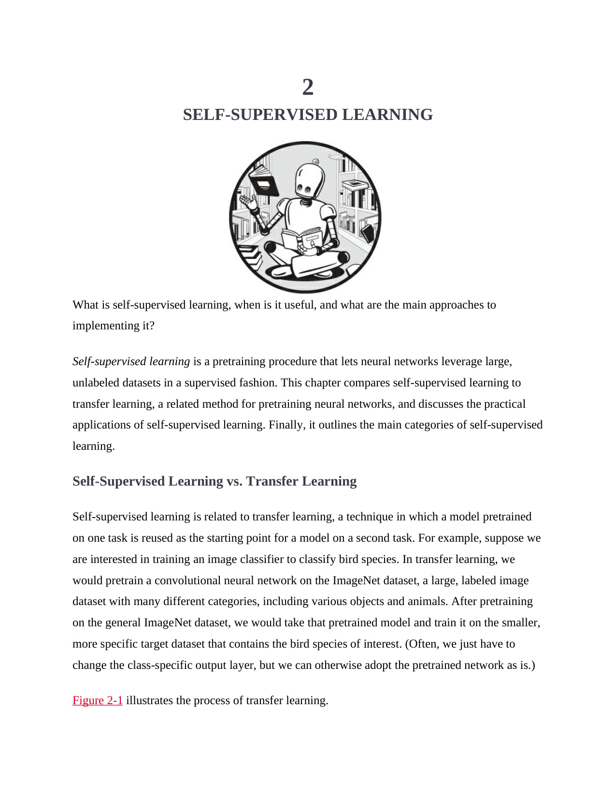

# 第 41 页

---

以下是您提供的英文内容的**逐句解析与翻译**（一行英文，一行中文），并附有详细解释和背景知识说明，帮助你深入理解“自监督学习”这一核心概念。

---

### 🔹 章节标题

> **2**  
> **SELF-SUPERVISED LEARNING**  
> 第2章：自监督学习

> 📌 **插图说明**：  
> 一个机器人坐在图书馆里看书，象征“自我学习”或“自主学习”，呼应本章主题——模型通过自身数据进行学习，无需外部标注。

---

### 🔹 引导问题

> **What is self-supervised learning, when is it useful, and what are the main approaches to implementing it?**  
> 什么是自监督学习？它在什么时候有用？实现它的主要方法有哪些？

> ✅ 这是本章的核心问题，引导读者思考：
> - 自监督学习的本质
> - 它的应用场景
> - 实现技术路径

---

### 🔹 概念定义

> **Self-supervised learning is a pretraining procedure that lets neural networks leverage large, unlabeled datasets in a supervised fashion.**  
> 自监督学习是一种预训练过程，它使神经网络能够以监督学习的方式利用大规模未标注数据集。

> 💡 **关键点解析**：
> - **pretraining**：预训练，即先用大量数据训练模型，再用于下游任务。
> - **unlabeled datasets**：没有标签的数据（如一张图片，不知道是什么）。
> - **supervised fashion**：虽然数据无标签，但通过设计“伪标签”（pseudo-labels）来模拟监督信号。
> - 例如：遮住图像的一部分，让模型预测缺失部分 → 这个“预测任务”就是监督信号。

> ✅ 所以，自监督学习 = **用无标签数据做“假监督”训练**

---

### 🔹 本章目标

> **This chapter compares self-supervised learning to transfer learning, a related method for pretraining neural networks, and discusses the practical applications of self-supervised learning. Finally, it outlines the main categories of self-supervised learning.**  
> 本章将自监督学习与迁移学习（一种相关的神经网络预训练方法）进行比较，并讨论自监督学习的实际应用。最后，概述了自监督学习的主要类别。

> 🧩 **结构预告**：
> 1. 对比自监督 vs. 迁移学习
> 2. 应用案例
> 3. 分类方法（如自预测、对比学习等）

---

### 🔹 小节标题

> **Self-Supervised Learning vs. Transfer Learning**  
> 自监督学习 vs. 迁移学习

> 🟩 开始对比两个重要预训练范式。

---

### 🔹 自监督学习与迁移学习的关系

> **Self-supervised learning is related to transfer learning, a technique in which a model pretrained on one task is reused as the starting point for a model on a second task.**  
> 自监督学习与迁移学习相关，后者是一种技术，即在一个任务上预训练的模型被用作第二个任务模型的起点。

> ✅ 解释：
> - **迁移学习**：先在大任务（如 ImageNet）上训练模型，然后迁移到小任务（如鸟种分类）。
> - 关键是“**复用已有知识**”。

---

### 🔹 举个例子

> **For example, suppose we are interested in training an image classifier to classify bird species. In transfer learning, we would pretrain a convolutional neural network on the ImageNet dataset, a large, labeled image dataset with many different categories, including various objects and animals.**  
> 例如，假设我们想训练一个图像分类器来识别鸟类物种。在迁移学习中，我们会先在 ImageNet 数据集上预训练一个卷积神经网络，该数据集是一个大型、标注丰富的图像数据集，包含许多不同类别，包括各种物体和动物。

> 📚 背景知识：
> - **ImageNet**：含超过1400万张图像，1000个类别，是深度学习训练的标准数据集。
> - 使用它预训练模型可以学到通用视觉特征（如边缘、纹理、形状）。

---

### 🔹 继续讲解迁移学习流程

> **After pretraining on the general ImageNet dataset, we would take that pretrained model and train it on the smaller, more specific target dataset that contains the bird species of interest. (Often, we just have to change the class-specific output layer, but we can otherwise adopt the pretrained network as is.)**  
> 在对通用的 ImageNet 数据集完成预训练后，我们会使用这个预训练模型，在更小、更具体的靶标数据集上继续训练，该数据集包含感兴趣的鸟类物种。（通常我们只需要更改特定类别的输出层，其余部分可以直接保留原样使用。）

> ✅ 关键操作：
> - **冻结主干网络**（backbone）：保持前面的卷积层不变
> - **替换分类头**（classifier head）：只训练最后一层
> - 这样既节省时间，又能避免过拟合

---

### 🔹 图示引用

> **Figure 2-1 illustrates the process of transfer learning.**  
> 图2-1展示了迁移学习的过程。

> 📌 提示：虽然图未显示，但通常会展示：
> - 左边：ImageNet 上训练 → 得到通用模型
> - 右边：微调（fine-tuning）→ 适应新任务（如鸟种分类）

---

### ✅ 总结要点

| 概念 | 内容 |
|------|------|
| **自监督学习** | 利用无标签数据进行“伪监督”训练，提取通用表示 |
| **迁移学习** | 先在大任务上训练，再迁移到小任务上 |
| **两者关系** | 都是预训练方式；迁移学习依赖有标签数据，而自监督学习可处理无标签数据 |
| **典型应用场景** | 大模型预训练（如LLM、Vision Transformer） |
| **优势** | 减少对标注数据的依赖，提升泛化能力 |

---

### 🎯 核心思想一句话总结：

> **自监督学习是一种让神经网络从海量未标注数据中“自学”特征的强大技术，它通过设计代理任务（如重建、对比）来生成监督信号，从而为后续任务提供强大的初始表示。**

---

如果您希望我继续分析后续内容（比如 Figure 2-1 的具体内容、自监督学习的两类方法等），欢迎继续提问！

 | [[page_040|« 上一页]] | [[../README|📖 回到书页]] | [[page_042|下一页 »]]
