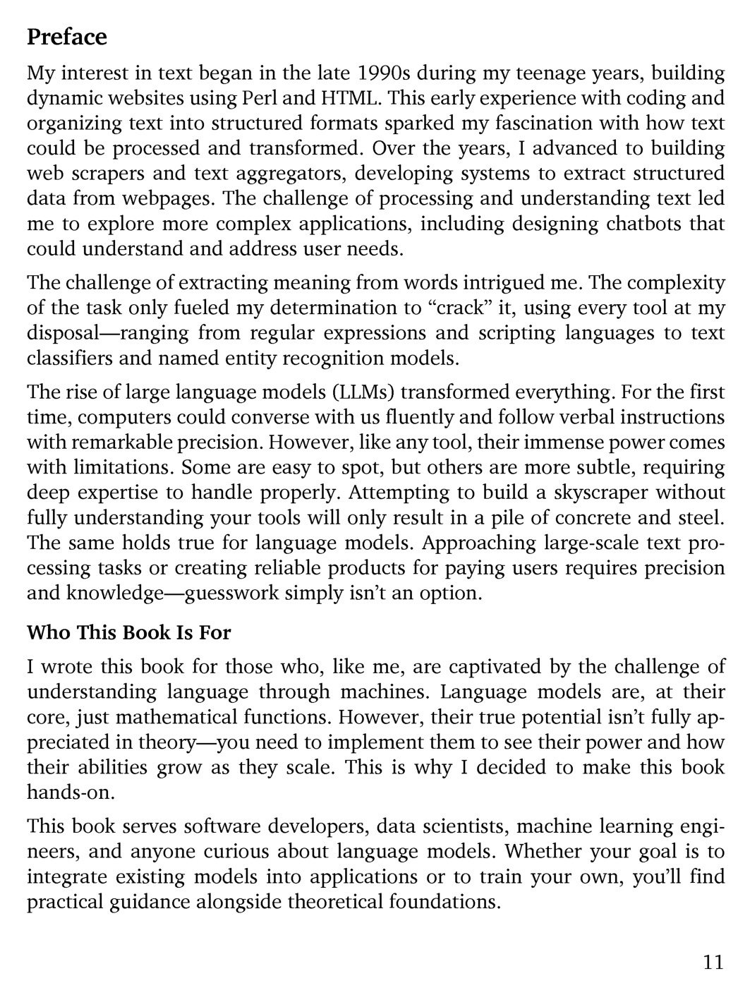

# 第 12 页

---

 | [[page_011|« 上一页]] | [[../README|📖 回到书页]] | [[page_013|下一页 »]]

# Preface 前言
My interest in text began in the late 1990s during my teenage years, building dynamic websites using Perl and HTML.
我对文本的兴趣始于20世纪90年代末，那时我还是个青少年，用Perl和HTML搭建动态网站。

This early experience with coding and organizing text into structured formats sparked my fascination with how text could be processed and transformed.
这段早期的编码经历，以及将文本整理成结构化格式的过程，让我对文本的处理与转换方式产生了浓厚的兴趣。

Over the years, I advanced to building web scrapers and ==text aggregators==（文本聚合工具）, developing systems to extract structured data from webpages.
多年来，我逐步进阶，开始编写网络爬虫和文本聚合工具，开发从网页中提取结构化数据的系统。

The challenge of processing and understanding text led me to explore more complex applications, including designing chatbots that could understand and address user needs.
处理和理解文本的挑战，驱使我探索更复杂的应用场景，包括设计能够理解并响应用户需求的聊天机器人。

The challenge of extracting meaning from words intrigued me.
从文字中提取含义的难题深深吸引了我。

The complexity of the task only fueled my determination to “crack” it, using every tool at my disposal—ranging from regular expressions and scripting languages to text classifiers and named entity recognition models.
这项任务的复杂性反而坚定了我“攻克它”的决心，我动用了所有可用的工具——从正则表达式、脚本语言，到文本分类器和命名实体识别模型。

The rise of large language models (LLMs) transformed everything.
大语言模型（LLM）的崛起彻底改变了一切。

For the first time, computers could converse with us fluently and follow verbal instructions with remarkable precision.
计算机第一次能够流畅地与我们对话，并以惊人的精度执行口头指令。

However, like any tool, their immense power comes with limitations.
但和所有工具一样，它们强大的能力也伴随着局限性。

Some are easy to spot, but others are more subtle, requiring deep expertise to handle properly.
有些局限显而易见，另一些则更为隐蔽，需要深厚的专业知识才能妥善处理。

Attempting to build a skyscraper without fully understanding your tools will only result in a pile of concrete and steel.
不彻底了解工具就试图建造摩天大楼，最终只会得到一堆混凝土和钢筋。

The same holds true for language models.
语言模型也是如此。

Approaching large-scale text processing tasks or creating reliable products for paying users requires precision and knowledge—guesswork simply isn’t an option.
处理大规模文本任务或为付费用户打造可靠产品，需要精准和专业知识——靠猜测是行不通的。

---

# Who This Book Is For 本书面向的读者
I wrote this book for those who, like me, are captivated by the challenge of understanding language through machines.
我写这本书，是为了那些和我一样，被“用机器理解语言”这一挑战深深吸引的人。

Language models are, at their core, just mathematical functions.
语言模型的本质，不过是数学函数而已。

However, their true potential isn’t fully appreciated in theory—you need to implement them to see their power and how their abilities grow as they scale.
但它们的真正潜力无法仅从理论上被充分认识——你需要亲手实现它们，才能见识其力量，以及随着规模扩大，它们的能力如何成长。

This is why I decided to make this book hands-on.
这也是我决定让这本书偏向实践的原因。

This book serves software developers, data scientists, machine learning engineers, and anyone curious about language models.
本书面向软件开发者、数据科学家、机器学习工程师，以及所有对语言模型感到好奇的读者。

Whether your goal is to integrate existing models into applications or to train your own, you’ll find practical guidance alongside theoretical foundations.
无论你的目标是将现有模型集成到应用中，还是训练自己的模型，你都能在这里找到理论基础与实用指导。

 | [[page_011|« 上一页]] | [[../README|📖 回到书页]] | [[page_013|下一页 »]]
