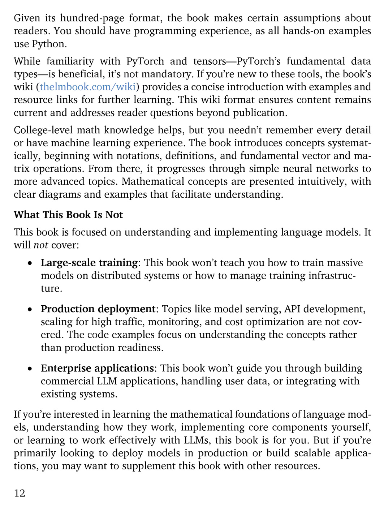

# 第 13 页

---

# 逐句中文翻译+要点注解
## 一、读者前置要求部分
1. **Given its hundred-page format, the book makes certain assumptions about readers.**
译：受限于全书百页的篇幅，本书对读者的基础能力有一定门槛要求。
注解：本书精简篇幅，不会从零补习编程/数学通识。

2. **You should have programming experience, as all hands-on examples use Python.**
译：读者需要具备编程基础，全书实操示例均基于Python语言编写。
注解：必备条件：会Python；可选：PyTorch、高数。

3. **While familiarity with PyTorch and tensors—PyTorch’s fundamental data types—is beneficial, it’s not mandatory.**
译：熟悉PyTorch与张量（PyTorch的基础数据格式）会更利于阅读，但并非硬性要求。
注解：tensors=张量，深度学习基础数据单元。

4. **If you’re new to these tools, the book’s wiki (thelbook.com/wiki) provides a concise introduction with examples and resource links for further learning.**
译：若初次接触以上工具，本书配套维基网站（thelbook.com/wiki）附带精简入门教程、代码示例与拓展学习资料链接。

5. **This wiki format ensures content remains current and addresses reader questions beyond publication.**
译：维基形式可以持续更新内容，解决书本定稿出版后读者新增的疑问。

6. **College-level math knowledge helps, but you needn’t remember every detail or have machine learning experience.**
译：拥有大学水平数学基础会锦上添花，但无需熟记全部数学细节，也不用提前掌握机器学习相关经验。

7. **The book introduces concepts systematically, beginning with notations, definitions, and fundamental vector and matrix operations.**
译：本书循序渐进系统化授课，从符号定义、基础向量、矩阵运算起步。

8. **From there, it progresses through simple neural networks to more advanced topics.**
译：顺着知识点由浅层神经网络逐步过渡到高阶内容。

9. **Mathematical concepts are presented intuitively, with clear diagrams and examples that facilitate understanding.**
译：书中数学概念偏向通俗直观讲解，搭配示意图与实例辅助理解。

---
## 二、What This Book Is Not · 本书不覆盖的内容
**总起：This book is focused on understanding and implementing language models. It will not cover:**
译：本书核心聚焦「理解+手动实现语言模型」，以下内容不在本书讲解范畴：

### ① Large-scale training（大规模分布式训练）
- This book won’t teach you how to train massive models on distributed systems or how to manage training infrastructure.
译：不讲授在多机分布式集群训练超大模型、训练集群运维基建相关内容。

### ② Production deployment（工程上线部署）
- Topics like model serving, API development, scaling for high traffic, monitoring, and cost optimization are not covered.
译：不包含模型服务部署、API接口开发、高并发扩容、线上监控、算力成本优化。
- The code examples focus on understanding the concepts rather than production readiness.
译：书中示例代码仅服务原理学习，不满足工业生产上线标准。

### ③ Enterprise applications（企业级商用落地）
- This book won’t guide you through building commercial LLM applications, handling user data, or integrating with existing systems.
译：不指导商用大模型产品开发、用户数据合规处理、企业现有系统对接集成。

---
## 三、收尾总结段
1. **If you’re interested in learning the mathematical foundations of language models, understanding how they work, implementing core components yourself, or learning to work effectively with LLMs, this book is for you.**
译：如果你想要学习大模型数学原理、吃透内部运行逻辑、亲手搭建模型核心模块、熟练使用大模型，本书适配你的需求。

2. **But if you’re primarily looking to deploy models in production or build scalable applications, you may want to supplement this book with other resources.**
译：若你的核心目标是工业部署、开发可扩容商用项目，则需要搭配其他工程类书籍补充学习。

 | [[page_012|« 上一页]] | [[../README|📖 回到书页]] | [[page_014|下一页 »]]
