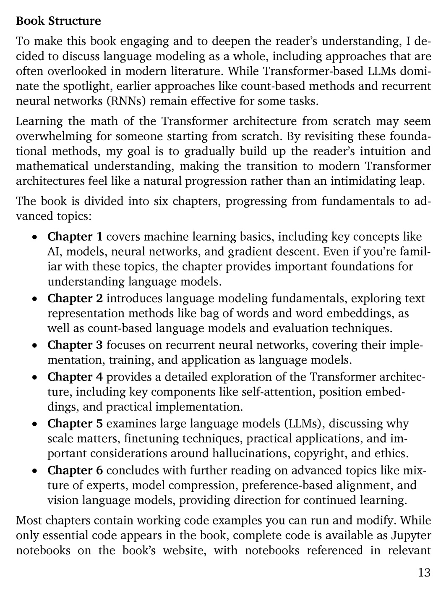

# 第 14 页

---

# Book Structure 本书结构（逐句翻译+要点注解）
## 开篇总论
1. **To make this book engaging and to deepen the reader’s understanding, I decided to discuss language modeling as a whole, including approaches that are often overlooked in modern literature.**
译：为提升阅读趣味性、加深读者理解，本书完整梳理语言建模全体系内容，囊括不少当下文献里常被忽略的经典算法方案。
注解：不直接只讲Transformer，兼顾传统经典模型。

2. **While Transformer-based LLMs dominate the spotlight, earlier approaches like count-based methods and recurrent neural networks (RNNs) remain effective for some tasks.**
译：尽管基于Transformer的大语言模型是当下主流，但词频统计法、循环神经网络（RNN）等早期方案在部分任务中依旧实用。

3. **Learning the math of the Transformer architecture may seem overwhelming for someone starting from scratch.**
译：零基础读者直接啃Transformer的数学原理难度极高。

4. **By revisiting these foundational methods, my goal is to gradually build up the reader’s intuition and mathematical understanding, making the transition to modern Transformer architectures feel like a natural progression rather than an intimidating leap.**
译：本书从传统基础模型循序渐进铺垫，帮读者逐步建立模型直觉与数理功底，让读者平滑过渡到现代Transformer架构，而非生硬跨越大跨度知识点。

5. **The book is divided into six chapters, progressing from fundamentals to advanced topics:**
译：全书共6个章节，知识点由基础内容逐步进阶到前沿专题：

---
## 六章分述
- **Chapter 1 covers machine learning basics, including key concepts like AI, models, neural networks, and gradient descent. Even if you’re familiar with these topics, the chapter provides important foundations for understanding language models.**
第1章：机器学习基础，涵盖人工智能、模型、神经网络、梯度下降等核心概念；即便读者已有相关基础，本章内容也能夯实理解语言模型所需的底层功底。

- **Chapter 2 introduces language modeling fundamentals, exploring text representation methods like bag of words and word embeddings, as well as count-based language models and evaluation techniques.**
第2章：语言建模基础，讲解词袋、词嵌入等文本表征方案，以及统计式语言模型与模型评估方法。

- **Chapter 3 focuses on recurrent neural networks, covering their implementation, training, and application as language models.**
第3章：聚焦循环神经网络（RNN），讲解RNN的代码实现、训练流程，以及它作为语言模型的落地使用。

- **Chapter 4 provides a detailed exploration of the Transformer architecture, including key components like self-attention, position embeddings, and practical implementation.**
第4章：深度拆解Transformer架构，包含自注意力、位置嵌入等核心模块与工程落地实现。

- **Chapter 5 examines large language models (LLMs), discussing why scale matters, finetuning techniques, practical applications, and important considerations around hallucinations, copyright, and ethics.**
第5章：详解大语言模型（LLM），探讨模型规模的意义、微调方法、落地应用，同时分析模型幻觉、版权、伦理等关键问题。

- **Chapter 6 concludes with further reading on advanced topics like mixture of experts, model compression, preference-based alignment, and vision language models, providing direction for continued learning.**
第6章：收尾拓展前沿内容，包含混合专家MoE、模型压缩、基于偏好对齐、多模态大模型等方向，为读者后续深入学习指明路径。

---
## 末尾代码说明
1. **Most chapters contain working code examples you can run and modify.**
译：绝大部分章节附带可直接运行、自定义修改的完整示例代码。

2. **While only essential code appears in the book, complete code is available as Jupyter notebooks on the book’s website, with notebooks referenced in relevant.**
译：书本正文只保留关键代码片段，完整工程代码以Jupyter笔记本形式放在本书官网，正文对应位置标注了源码链接。

### 💡全书学习路线速记
机器学习基础→文本表征+传统统计LM→RNN序列模型→Transformer原理→大模型LLM实操与伦理→前沿多模型拓展

 | [[page_013|« 上一页]] | [[../README|📖 回到书页]] | [[page_015|下一页 »]]
