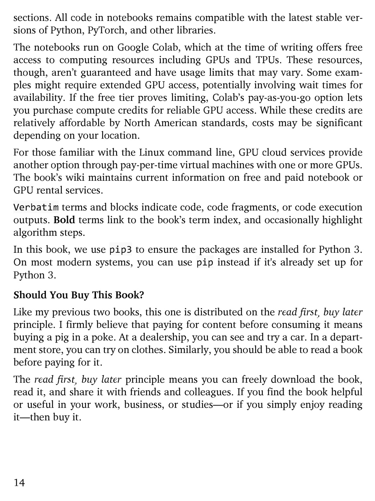

# 第 15 页

---

# 逐句中文翻译+简要注解
## 一、代码与运行环境说明
1. **sections. All code in notebooks remains compatible with the latest stable versions of Python, PyTorch, and other libraries.**
译：（代码链接标注在）对应章节中；所有Jupyter源码均可适配Python、PyTorch及各类依赖库的最新稳定版。

2. **The notebooks run on Google Colab, which at the time of writing offers free access to computing resources including GPUs and TPUs.**
译：示例笔记可在谷歌Colab平台运行，本书成书时，该平台免费开放GPU、TPU等算力资源。

3. **These resources, though, aren’t guaranteed and have usage limits that may vary.**
译：但免费算力不做永久保障，且存在浮动的使用配额限制。

4. **Some examples might require extended GPU access, potentially involving wait times for availability.**
译：部分案例需要长时间占用GPU，资源紧张时需要排队等候。

5. **If the free tier proves limiting, Colab’s pay-as-you-go option lets you purchase compute credits for reliable GPU access.**
译：若免费额度不够使用，Colab提供按需付费套餐，可购买算力点数稳定使用GPU。

6. **While these credits are relatively affordable by North American standards, costs may be significant depending on your location.**
译：按北美物价标准来看，该付费定价偏低，但不同地区用户实际花费差异较大。

7. **For those familiar with the Linux command line, GPU cloud services provide another option through pay-per-time virtual machines with one or more GPUs.**
译：熟悉Linux命令行的读者可选择云GPU服务，按时长租用搭载单块或多块显卡的云主机。

8. **The book’s wiki maintains current information on free and paid notebook or GPU rental services.**
译：本书配套维基页面会实时更新各类免费/付费云笔记、GPU租赁渠道。

---
## 二、排版与代码标记规范
1. **Verbatim terms and blocks indicate code, code fragments, or code execution outputs.**
译：正文里的等宽格式文字/代码块，用来标注完整代码、代码片段或程序运行结果。

2. **Bold terms link to the book’s term index, and occasionally highlight algorithm steps.**
译：加粗的专业名词可在本书名词索引中检索，部分加粗内容用于标注关键算法步骤。

3. **In this book, we use pip3 to ensure the packages are installed for Python 3.**
译：全书统一用`pip3`命令，保证依赖包安装至Python3环境。

4. **On most modern systems, you can use pip instead if it's already set up for Python 3.**
译：多数现代操作系统中，若`pip`已默认绑定Python3，也可直接使用`pip`命令。

---
## 三、Should You Buy This Book? 是否值得购入本书
1. **Like my previous two books, this one is distributed on the read first, buy later principle.**
译：和作者前两本著作一致，本书遵循「先试读、后付费」的发行原则。

2. **I firmly believe that paying for content before consuming it means buying a pig in a poke.**
译：作者秉持观点：未阅读就付费购书，等同于盲目买货、无从核验品质（buy a pig in a poke：英文谚语，喻盲目消费）。

3. **At a dealership, you can see and try a car. In a department store, you can try on clothes.**
译：买车可以到4S店试驾、买衣服可以在商场试穿。

4. **Similarly, you should be able to read a book before paying for it.**
译：同理，书籍也该先阅读、满意之后再付费购买。

5. **The read first, buy later principle means you can freely download the book, read it, and share it with friends and colleagues.**
译：先读后买规则：读者可免费下载全书、自主阅读，还能分享给好友与同行。

6. **If you find the book helpful or useful in your work, business, or studies—or if you simply enjoy reading it—then buy it.**
译：如果本书对你学习、工作、项目落地有所帮助，或是单纯喜爱内容，再付费支持正版即可。

---

 | [[page_014|« 上一页]] | [[../README|📖 回到书页]] | [[page_016|下一页 »]]
