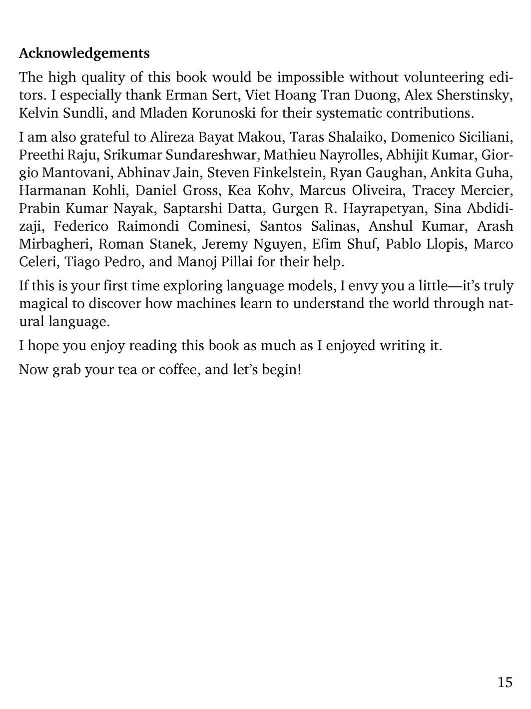

# 第 16 页

---

 | [[page_015|« 上一页]] | [[../README|📖 回到书页]] | [[page_017|下一页 »]]

# Acknowledgements 致谢
我来为你逐句翻译并解析这段前言的收尾部分：

---

1.  **The high quality of this book would be impossible without volunteering editors.**
    译：没有这些志愿编辑的帮助，这本书的高质量是无法实现的。
    解析：作者开篇直接感谢所有参与审校的志愿者，点明他们对书籍质量的关键作用。

2.  **I especially thank Erman Sert, Viet Hoang Tran Duong, Alex Sherstinsky, Kelvin Sundli, and Mladen Korunoski for their systematic contributions.**
    译：我要特别感谢 Erman Sert、Viet Hoang Tran Duong、Alex Sherstinsky、Kelvin Sundli 和 Mladen Korunoski，感谢他们系统性的贡献。
    解析：点名感谢几位核心贡献者，他们的工作不是零散的修改，而是“系统性”的审校与完善。

3.  **I am also grateful to Alireza Bayat Makou, Taras Shalaiko, Domenico Siciliani, Preethi Raju, Srikumar Sundareshwar, Mathieu Nayrolles, Abhijit Kumar, Giorgio Mantovani, Abhinav Jain, Steven Finkelstein, Ryan Gaughan, Ankita Guha, Harmanan Kohli, Daniel Gross, Kea Kohv, Marcus Oliveira, Tracey Mercier, Prabin Kumar Nayak, Saptarshi Datta, Gurgen R. Hayrapetyan, Sina Abdidizaji, Federico Raimondi Cominesi, Santos Salinas, Anshul Kumar, Arash Mirbagheri, Roman Stanek, Jeremy Nguyen, Efim Shuf, Pablo Llopis, Marco Celeri, Tiago Pedro, and Manoj Pillai for their help.**
    译：我也感谢 Alireza Bayat Makou、Taras Shalaiko、Domenico Siciliani、Preethi Raju、Srikumar Sundareshwar、Mathieu Nayrolles、Abhijit Kumar、Giorgio Mantovani、Abhinav Jain、Steven Finkelstein、Ryan Gaughan、Ankita Guha、Harmanan Kohli、Daniel Gross、Kea Kohv、Marcus Oliveira、Tracey Mercier、Prabin Kumar Nayak、Saptarshi Datta、Gurgen R. Hayrapetyan、Sina Abdidizaji、Federico Raimondi Cominesi、Santos Salinas、Anshul Kumar、Arash Mirbagheri、Roman Stanek、Jeremy Nguyen、Efim Shuf、Pablo Llopis、Marco Celeri、Tiago Pedro 和 Manoj Pillai 的帮助。
    解析：作者列出了一长串帮助过他的读者/同行，这是技术书籍致谢部分的常见形式，表达了对所有参与审校人员的感谢。

4.  **If this is your first time exploring language models, I envy you a little—it’s truly magical to discover how machines learn to understand the world through natural language.**
    译：如果你是第一次探索语言模型，我有一点点羡慕你——发现机器如何通过自然语言学习理解这个世界，真的是一件很奇妙的事。
    解析：作者在这里表达了对读者的祝福，将学习语言模型比作一场“奇妙的探索之旅”，拉近了与读者的距离。

5.  **I hope you enjoy reading this book as much as I enjoyed writing it.**
    译：我希望你能像我享受写作一样，享受阅读这本书的过程。
    解析：这是一个温暖的收尾，表达了作者对读者的美好祝愿。

6.  **Now grab your tea or coffee, and let’s begin!**
    译：现在，泡上一杯茶或咖啡，让我们开始吧！
    解析：一句轻松的号召，正式开启全书的内容。

---

如果你需要，我可以帮你把这本书前面所有章节的目录和前言整理成一份**学习路线图**，方便你按顺序复习。