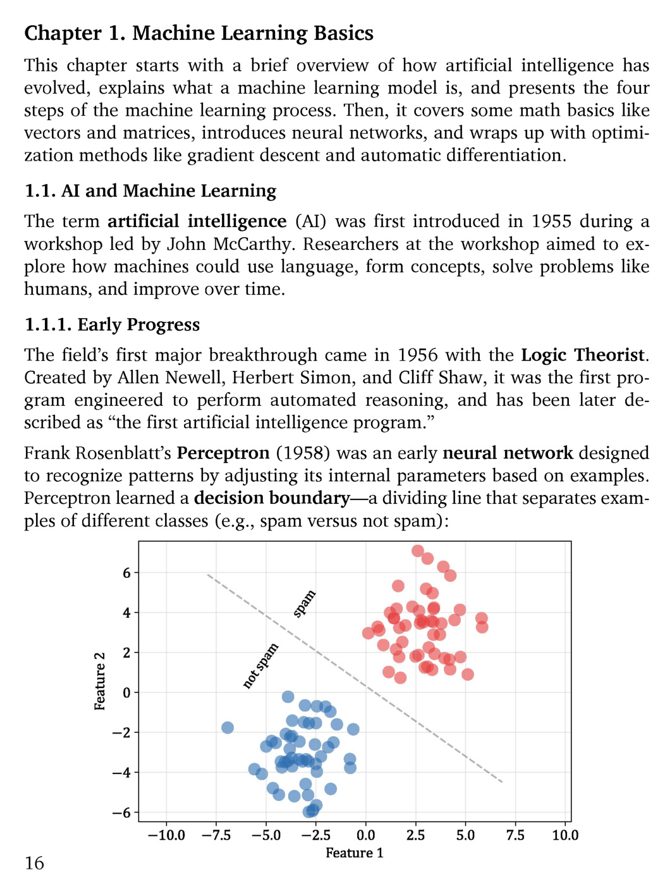

# 第 17 页

---

# Chapter 1. Machine Learning Basics
## 本章内容概览
> This chapter starts with a brief overview of how artificial intelligence has evolved, explains what a machine learning model is, and presents the four steps of the machine learning process. Then, it covers some math basics like vectors and matrices, introduces neural networks, and wraps up with optimization methods like gradient descent and automatic differentiation.

**翻译与解析：**
本章开篇简要梳理人工智能的发展历程，解释“机器学习模型”的定义，并介绍机器学习流程的四大步骤。随后，讲解向量、矩阵等数学基础，引入神经网络概念，最后以梯度下降、自动微分等优化方法收尾。

- 核心内容结构：AI发展→ML模型定义→ML流程→数学基础→神经网络→优化算法（梯度下降、自动微分）
- 作用：为后续语言模型章节，铺垫必备的机器学习与数学基础。

---

## 1.1 AI and Machine Learning
> The term artificial intelligence (AI) was first introduced in 1955 during a workshop led by John McCarthy. Researchers at the workshop aimed to explore how machines could use language, form concepts, solve problems like humans, and improve over time.

**翻译与解析：**
“人工智能（AI）”一词于1955年在约翰·麦卡锡主持的研讨会上首次提出。当时的研究者旨在探索：机器如何像人类一样使用语言、形成概念、解决问题，并实现自我迭代改进。

- 背景补充：这次研讨会就是著名的达特茅斯会议，被公认为AI学科的起点。
- 核心目标：从一开始，AI就瞄准了“语言理解、概念学习、问题求解、持续进化”这些和语言模型强相关的能力。

---

## 1.1.1 Early Progress
> The field’s first major breakthrough came in 1956 with the Logic Theorist. Created by Allen Newell, Herbert Simon, and Cliff Shaw, it was the first program engineered to perform automated reasoning, and has been later described as “the first artificial intelligence program.”

**翻译与解析：**
AI领域的首个重大突破是1956年的“逻辑理论家（Logic Theorist）”。由Allen Newell、Herbert Simon和Cliff Shaw开发，它是首个实现自动推理的程序，也被后世称为“第一个人工智能程序”。

- 历史意义：它首次证明机器可以完成逻辑推理任务，是AI早期的里程碑式成果。

> Frank Rosenblatt’s Perceptron (1958) was an early neural network designed to recognize patterns by adjusting its internal parameters based on examples. Perceptron learned a decision boundary—a dividing line that separates examples of different classes (e.g., spam versus not spam):

**翻译与解析：**
Frank Rosenblatt于1958年提出的“感知机（Perceptron）”是早期神经网络的代表，它通过学习样本数据调整内部参数，实现模式识别。感知机的核心是学习一个**决策边界（decision boundary）**——一条划分不同类别的分界线（例如区分“垃圾邮件”和“正常邮件”）。

- 核心概念：感知机是现代神经网络的雏形，它证明了机器可以从数据中学习出线性的分类边界。
- 配图解析：

  图中横轴为特征1（Feature 1），纵轴为特征2（Feature 2）。蓝色点代表“非垃圾邮件（not spam）”，红色点代表“垃圾邮件（spam）”，中间的虚线就是感知机学到的线性决策边界。
  感知机通过调整权重和偏置，找到这条线，实现两类数据的线性划分。

---

### 💡 关键术语速记
| 术语 | 定义 |
|------|------|
| Artificial Intelligence (AI) | 人工智能，1955年达特茅斯会议上提出的学科概念 |
| Logic Theorist | 1956年首个实现自动推理的AI程序 |
| Perceptron | 1958年提出的早期神经网络，可学习线性决策边界 |
| Decision Boundary | 决策边界，模型划分不同类别的分界线 |

---

 | [[page_016|« 上一页]] | [[../README|📖 回到书页]] | [[page_018|下一页 »]]
