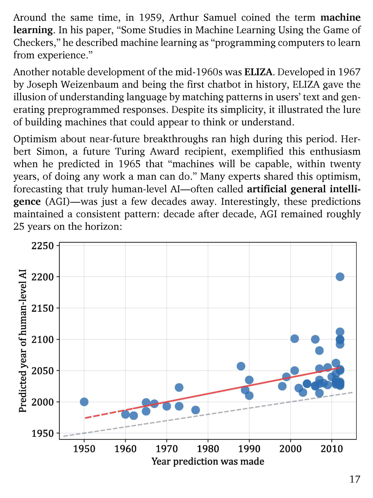

# 第 18 页

---

我来为你逐句翻译并解析这段内容：

---

### 第一句
> Around the same time, in 1959, Arthur Samuel coined the term machine learning. In his paper, “Some Studies in Machine Learning Using the Game of Checkers,” he described machine learning as “programming computers to learn from experience.”

**翻译：**
几乎在同一时期，1959年，亚瑟·塞缪尔（Arthur Samuel）首次提出了**机器学习（machine learning）**这一术语。在他的论文《使用西洋跳棋游戏进行的机器学习研究》中，他将机器学习定义为“让计算机能够从经验中学习的编程方式”。

**解析：**
- “coined the term” 意为“首次提出/创造了术语”，塞缪尔被认为是机器学习的奠基人之一。
- 这个定义是机器学习最经典的早期定义，核心是“从经验中学习”，而非被硬编码规则。

---

### 第二句
> Another notable development of the mid-1960s was ELIZA. Developed in 1967 by Joseph Weizenbaum and being the first chatbot in history, ELIZA gave the illusion of understanding language by matching patterns in users’ text and generating preprogrammed responses. Despite its simplicity, it illustrated the lure of building machines that could appear to think or understand.

**翻译：**
20世纪60年代中期另一个值得关注的成果是**ELIZA**。它由约瑟夫·魏岑鲍姆（Joseph Weizenbaum）于1967年开发，是历史上第一个聊天机器人。ELIZA通过匹配用户文本中的模式并生成预设回复，营造出理解语言的假象。尽管实现非常简单，但它展示了构建看似能思考或理解的机器的巨大吸引力。

**解析：**
- ELIZA是自然语言处理和对话系统的早期里程碑，它没有真正的理解能力，只是基于规则和关键词匹配生成回复。
- “gave the illusion of understanding language” 精准点出了这类早期系统的本质：并非真正理解，而是制造了理解的错觉。

---

### 第三句
> Optimism about near-future breakthroughs ran high during this period. Herbert Simon, a future Turing Award recipient, exemplified this enthusiasm when he predicted in 1965 that “machines will be capable, within twenty years, of doing any work a man can do.” Many experts shared this optimism, forecasting that truly human-level AI—often called artificial general intelligence (AGI)—was just a few decades away. Interestingly, these predictions maintained a consistent pattern: decade after decade, AGI remained roughly 25 years on the horizon:

**翻译：**
在这一时期，人们对短期内实现重大突破抱有极高的乐观情绪。未来的图灵奖得主赫伯特·西蒙（Herbert Simon）在1965年的预测就体现了这种热情，他说：“二十年内，机器将能够完成人类能做的任何工作。”许多专家也持同样的乐观态度，预测真正达到人类水平的AI——即所谓的**通用人工智能（AGI）**——距离我们只有几十年。有趣的是，这些预测呈现出一个持续不变的模式：年复一年，AGI始终停留在大约“25年后”的位置上。

**解析：**
- “ran high” 表示情绪高涨、乐观盛行。
- 西蒙的预测是AI历史上著名的“乐观主义预言”，反映了早期研究者对技术发展速度的高估。
- “AGI remained roughly 25 years on the horizon” 是一个经典的调侃，说明AGI的实现时间总是被预测为“永远在25年后”，从未真正临近。

---

### 配图解析
这张图展示了不同年份人们对AGI实现年份的预测：
- 横轴：做出预测的年份
- 纵轴：预测的AGI实现年份
- 可以看到，随着时间推移，预测的实现年份也同步后移，两者之间的差距始终保持在约25年，完美印证了文中的观点。

---

如果你需要，我可以帮你把这段内容里的**关键AI历史事件**整理成一份时间线速记表，方便你复习。

---

 | [[page_017|« 上一页]] | [[../README|📖 回到书页]] | [[page_019|下一页 »]]
