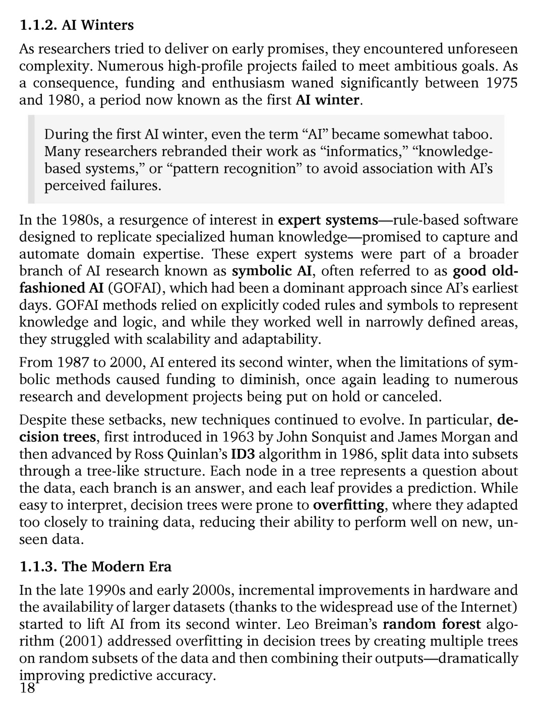

# 第 19 页

---

# 1.1.2 AI Winters 逐句翻译与解析
> As researchers tried to deliver on early promises, they encountered unforeseen complexity. Numerous high-profile projects failed to meet ambitious goals. As a consequence, funding and enthusiasm waned significantly between 1975 and 1980, a period now known as the first AI winter.

**翻译：**
当研究者试图兑现早期承诺时，他们遭遇了始料未及的复杂性。许多备受关注的项目都未能达成其宏大目标。因此，在1975年至1980年间，资金投入和研究热情大幅消退，这一时期后来被称为第一次AI寒冬。

**解析：**
- 核心背景：早期AI的过度乐观与实际技术瓶颈之间的落差，导致了资金和热度的快速降温。
- “AI winter” 是AI发展史上的关键概念，特指研究热情与资金大幅退潮的时期。

---

> During the first AI winter, even the term “AI” became somewhat taboo. Many researchers rebranded their work as “informatics,” “knowledge-based systems,” or “pattern recognition” to avoid association with AI’s perceived failures.

**翻译：**
在第一次AI寒冬期间，就连“AI”这个词本身都成了某种禁忌。许多研究者将自己的工作改名为“信息学”、“基于知识的系统”或“模式识别”，以避免和AI当时被认为的失败挂钩。

**解析：**
- 这段描述生动反映了当时的行业氛围：为了避免项目被打上“失败”的标签，研究者纷纷换用更中性的术语。

---

> In the 1980s, a resurgence of interest in expert systems—rule-based software designed to replicate specialized human knowledge—promised to capture and automate domain expertise. These expert systems were part of a broader branch of AI research known as symbolic AI, often referred to as good old-fashioned AI (GOFAI), which had been a dominant approach since AI’s earliest days.

**翻译：**
到了20世纪80年代，人们对**专家系统（expert systems）**的兴趣再度高涨。这类基于规则的软件旨在复刻人类的专业知识，有望实现特定领域专业技能的捕捉与自动化。这些专家系统属于更广泛的**符号AI（symbolic AI）**研究分支，也常被称为“老式人工智能（GOFAI）”，这是自AI诞生以来一直占据主导地位的研究范式。

**解析：**
- 专家系统是第二次AI浪潮的核心，依赖人工编写的规则库，在特定领域（如医疗诊断）取得了一定成功。
- GOFAI 指的是基于符号、逻辑和规则的AI方法，与后来兴起的统计学习、神经网络方法相对。

---

> GOFAI methods relied on explicitly coded rules and symbols to represent knowledge and logic, and while they worked well in narrowly defined areas, they struggled with scalability and adaptability.

**翻译：**
GOFAI方法依赖显式编写的规则和符号来表示知识与逻辑，虽然它们在定义狭窄的特定领域表现良好，但在可扩展性和适应性方面存在严重缺陷。

**解析：**
- 核心痛点：规则系统无法处理模糊、不确定的场景，也难以扩展到大型、开放的问题。

---

> From 1987 to 2000, AI entered its second winter, when the limitations of symbolic methods caused funding to diminish, once again leading to numerous research and development projects being put on hold or canceled.

**翻译：**
从1987年到2000年，AI进入了第二次寒冬。符号方法的局限性导致资金再次减少，大量研发项目被搁置或取消。

**解析：**
- 第二次AI寒冬的导火索：专家系统维护成本高、通用性差，无法满足商业化期望，资金再次撤离。

---

> Despite these setbacks, new techniques continued to evolve. In particular, decision trees, first introduced in 1963 by John Sonquist and James Morgan and then advanced by Ross Quinlan’s ID3 algorithm in 1986, split data into subsets through a tree-like structure. Each node in a tree represents a question about the data, each branch is an answer, and each leaf provides a prediction.

**翻译：**
尽管遭遇了这些挫折，新技术仍在不断发展。尤其是**决策树（decision trees）**，它于1963年由John Sonquist和James Morgan首次提出，并在1986年由Ross Quinlan的ID3算法得到了发展。决策树通过树状结构将数据划分为多个子集：树中的每个节点代表一个关于数据的问题，每个分支代表一个答案，每个叶子节点则给出最终的预测结果。

**解析：**
- 决策树是一种经典的监督学习算法，结构清晰、易于解释，是后续随机森林、梯度提升树等集成模型的基础。

---

> While easy to interpret, decision trees were prone to overfitting, where they adapted too closely to training data, reducing their ability to perform well on new, unseen data.

**翻译：**
虽然决策树易于解释，但它容易出现**过拟合（==overfitting==）**问题：即模型过度贴合训练数据，导致在新的、未见过的数据上表现不佳。

**解析：**
- 过拟合是机器学习的核心问题之一，指模型学习了训练数据中的噪声和特例，而失去了泛化能力。

---

# 1.1.3 The Modern Era 现代时期
> In the late 1990s and early 2000s, incremental improvements in hardware and the availability of larger datasets (thanks to the widespread use of the Internet) started to lift AI from its second winter.

**翻译：**
20世纪90年代末至21世纪初，硬件性能的逐步提升和互联网普及带来的大规模数据集，开始将AI从第二次寒冬中拉出。

**解析：**
- 现代AI的两大基石：更强的算力和更大的数据，为统计学习和神经网络的复兴铺平了道路。

---

> Leo Breiman’s random forest algorithm (2001) addressed overfitting in decision trees by creating multiple trees on random subsets of the data and then combining their outputs—dramatically improving predictive accuracy.

**翻译：**
Leo Breiman于2001年提出的**随机森林（random forest）**算法，通过在数据的随机子集上构建多棵决策树并结合它们的预测结果，解决了决策树的过拟合问题，大幅提升了预测准确率。

**解析：**
- 随机森林是集成学习的经典代表，通过“多棵树投票”的方式，既保留了决策树的可解释性，又显著降低了过拟合风险。

---

💡 如果你需要，我可以帮你把这段AI发展史整理成一份**时间线速记表**，方便你复习。

---

 | [[page_018|« 上一页]] | [[../README|📖 回到书页]] | [[page_020|下一页 »]]
