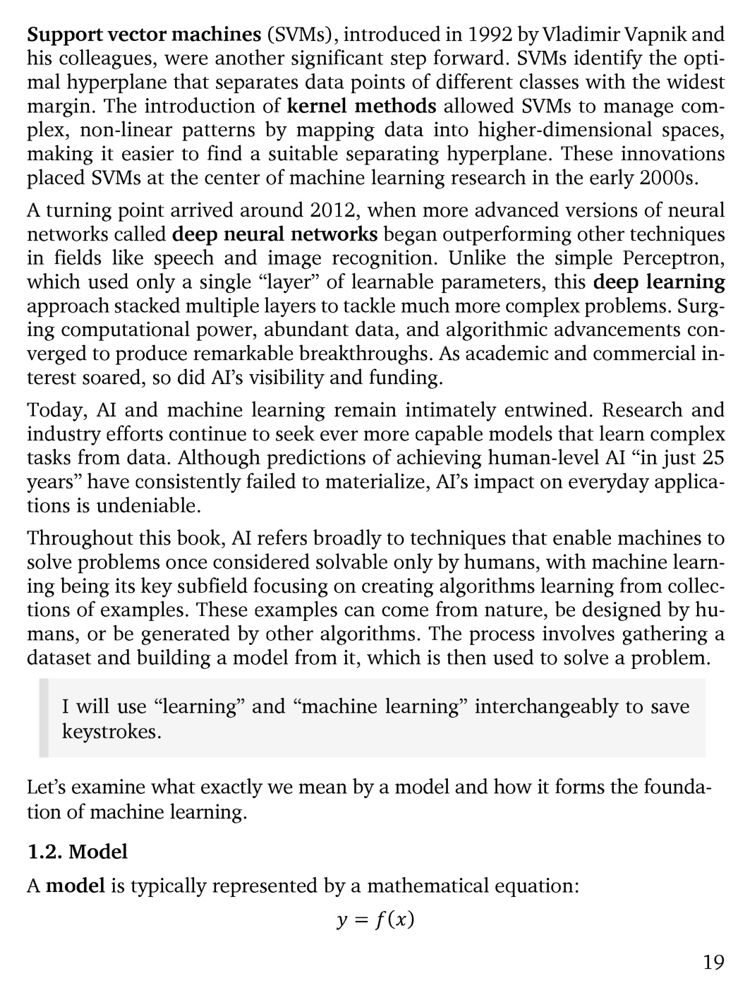

# 第 20 页

---

我来为你逐句翻译并解析这段内容：

---

### 1. Support vector machines (SVMs), introduced in 1992 by Vladimir Vapnik and his colleagues, were another significant step forward.
**翻译**：1992年由弗拉基米尔·瓦普尼克（Vladimir Vapnik）及其同事提出的**支持向量机（SVM）**，是机器学习发展史上的又一重要里程碑。
**解析**：SVM是2000年代最主流的监督学习算法之一，尤其在小样本、高维数据场景下表现优异。

### SVMs identify the optimal hyperplane that separates data points of different classes with the widest margin.
**翻译**：SVM的核心思想是找到一个**最优超平面**，以最大的间隔（margin）将不同类别的数据点分开。
**解析**：“最大间隔”是SVM的关键，它让模型在保证分类正确的同时，最大化分类边界与最近样本的距离，从而提升泛化能力。

### The introduction of kernel methods allowed SVMs to manage complex, non-linear patterns by mapping data into higher-dimensional spaces, making it easier to find a suitable separating hyperplane.
**翻译**：核方法（kernel methods）的引入，让SVM可以通过将数据映射到更高维的空间，处理复杂的非线性模式，从而更容易找到合适的分隔超平面。
**解析**：“核技巧”是SVM的精髓，它无需显式计算高维映射，就能在原空间实现非线性分类，是SVM能广泛应用的关键。

### These innovations placed SVMs at the center of machine learning research in the early 2000s.
**翻译**：这些创新让SVM在2000年代初期成为了机器学习研究的核心方法。

---

### A turning point arrived around 2012, when more advanced versions of neural networks called deep neural networks began outperforming other techniques in fields like speech and image recognition.
**翻译**：转折点出现在2012年左右，被称为**深度神经网络（deep neural networks）**的高级神经网络，在语音和图像识别等领域开始超越其他所有技术。
**解析**：2012年AlexNet在ImageNet竞赛中碾压性夺冠，标志着深度学习时代的正式开启。

### Unlike the simple Perceptron, which used only a single “layer” of learnable parameters, this deep learning approach stacked multiple layers to tackle much more complex problems.
**翻译**：与仅包含一层可学习参数的简单感知机不同，这种深度学习方法通过堆叠多层网络，能够解决更复杂的问题。
**解析**：“深度”的定义就是网络层数的堆叠，这让模型可以学习到更抽象、更高级的特征。

### Surging computational power, abundant data, and algorithmic advancements converged to produce remarkable breakthroughs.
**翻译**：算力的爆发、海量数据的积累和算法的进步共同促成了一系列重大突破。
**解析**：深度学习的崛起离不开这三大支柱：GPU算力、互联网带来的大数据、反向传播等算法优化。

### As academic and commercial interest soared, so did AI’s visibility and funding.
**翻译**：随着学术界和商业界的兴趣激增，AI的关注度和资金投入也水涨船高。

---

### Today, AI and machine learning remain intimately entwined.
**翻译**：如今，人工智能和机器学习依然紧密交织在一起。

### Research and industry efforts continue to seek ever more capable models that learn complex tasks from data.
**翻译**：学术界和工业界仍在不断探索更强大的模型，让它们能从数据中学习更复杂的任务。

### Although predictions of achieving human-level AI “in just 25 years” have consistently failed to materialize, AI’s impact on everyday applications is ==undeniable==.
**翻译**：尽管“25年内实现人类级AI”的预言一直未能实现，但AI对日常应用的影响已是不可否认的事实。
**解析**：这里呼应了前文提到的“AGI永远在25年后”的调侃，承认了通用人工智能的难度，但也肯定了弱AI的实际价值。

---

### Throughout this book, AI refers broadly to techniques that enable machines to solve problems once considered solvable only by humans, with machine learning being its key subfield focusing on creating algorithms learning from collections of examples.
**翻译**：在本书中，AI泛指所有让机器解决原本只有人类才能处理的问题的技术，而机器学习是其核心子领域，专注于构建能从样本数据中学习的算法。

### These examples can come from nature, be designed by humans, or be generated by other algorithms.
**翻译**：这些样本数据可以来自自然界、人工设计，也可以由其他算法生成。

### The process involves gathering a dataset and building a model from it, which is then used to solve a problem.
**翻译**：这个过程包括收集数据集、基于数据构建模型，再用模型来解决实际问题。

### I will use “learning” and “machine learning” ==interchangeably== to save ==keystrokes==.
**翻译**：为了节省篇幅，后文会交替使用“learning”和“machine learning”两个词。

---

### Let’s examine what exactly we mean by a model and how it forms the foundation of machine learning.
**翻译**：接下来，我们来探讨“模型”到底是什么，以及它如何构成机器学习的基础。

### 1.2. Model
**翻译**：1.2 模型

### A model is typically represented by a mathematical equation:
$$y = f(x)$$
**翻译**：模型通常可以用一个数学方程来表示：$y = f(x)$
**解析**：这是机器学习最核心的抽象定义。$x$是输入数据，$y$是预测输出，$f$就是我们要学习的函数，也就是模型本身。

---

💡 如果你需要，我可以帮你把这段里提到的**关键算法和时间节点**整理成一份时间线速记表，方便你复习。

 | [[page_019|« 上一页]] | [[../README|📖 回到书页]] | [[page_021|下一页 »]]
