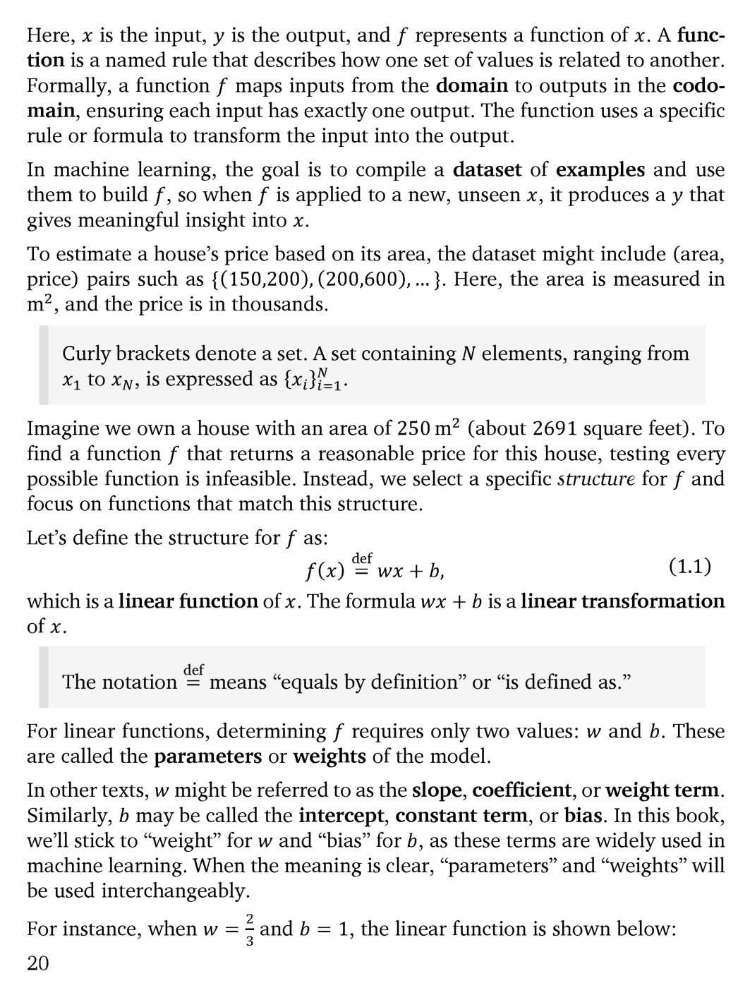

# 第 21 页

---

我来为你逐句翻译并解析这段内容：

---

### 1. 函数与模型的基础定义
> Here, \(x\) is the input, \(y\) is the output, and \(f\) represents a function of \(x\). A function is a named rule that describes how one set of values is related to another. Formally, a function \(f\) maps inputs from the **domain** to outputs in the **codomain**, ensuring each input has exactly one output. The function uses a specific rule or formula to transform the input into the output.

**翻译：**
这里，\(x\) 是输入，\(y\) 是输出，\(f\) 代表关于 \(x\) 的函数。函数是一个命名规则，描述一组值如何与另一组值关联。形式上，函数 \(f\) 将**定义域（domain）**中的输入映射到**陪域（codomain）**中的输出，确保每个输入都有且仅有一个输出。函数通过特定的规则或公式将输入转换为输出。

**解析：**
- 这是机器学习最核心的数学抽象：模型就是一个函数 \(f\)，它接收输入 \(x\) 并产生输出 \(y\)。
- “定义域”是输入的所有可能取值集合，“陪域”是输出的所有可能取值集合。
- 函数的核心特性：一个输入只能对应一个输出。

---

> In machine learning, the goal is to compile a **dataset** of examples and use them to build \(f\), so when \(f\) is applied to a new, unseen \(x\), it produces a \(y\) that gives meaningful insight into \(x\).

**翻译：**
在机器学习中，我们的目标是收集由样本构成的**数据集（dataset）**，并利用它们构建函数 \(f\)。这样，当 \(f\) 作用于新的、未见过的 \(x\) 时，它能产生一个对 \(x\) 有意义的预测 \(y\)。

**解析：**
- 机器学习的本质：从数据中学习出一个能泛化的函数 \(f\)，而不是靠人工硬编码规则。
- “有意义的预测”意味着模型需要具备泛化能力，能处理训练中没见过的数据。

---

> To estimate a house’s price based on its area, the dataset might include (area, price) pairs such as \(\{(150,200),(200,600),...\}\). Here, the area is measured in \(m^2\), and the price is in thousands.

**翻译：**
要根据房屋面积估算房价，数据集可能包含（面积，价格）这样的成对数据，例如 \(\{(150,200),(200,600),...\}\)。这里，面积的单位是平方米，价格的单位是千元。

**解析：**
- 这是一个监督学习的典型回归任务示例：输入是面积，输出是房价。
- 数据集是由多个（输入，输出）样本对构成的集合。

---

> Curly brackets denote a set. A set containing \(N\) elements, ranging from \(x_1\) to \(x_N\), is expressed as \(\{x_i\}_{i=1}^N\).

**翻译：**
大括号 `{}` 表示集合。包含 \(N\) 个元素（从 \(x_1\) 到 \(x_N\)）的集合，表示为 \(\{x_i\}_{i=1}^N\)。

**解析：**
- 这是数学中表示集合的标准符号，在机器学习中常用于表示数据集。

---

> Imagine we own a house with an area of \(250 \, m^2\) (about 2691 square feet). To find a function \(f\) that returns a reasonable price for this house, testing every possible function is infeasible. Instead, we select a specific structure for \(f\) and focus on functions that match this structure.

**翻译：**
假设我们有一套面积为250平方米（约2691平方英尺）的房子。要找到一个能给出合理房价的函数 \(f\)，测试所有可能的函数是不现实的。相反，我们会为 \(f\) 选定一个特定的结构，并专注于符合该结构的函数。

**解析：**
- 这解释了为什么机器学习需要“模型假设”：不可能穷举所有函数，因此需要限定函数的形式（如线性函数），然后学习其参数。

---

> Let’s define the structure for \(f\) as:
> \[
> f(x) \stackrel{\text{def}}{=} wx + b,
> \]
> which is a linear function of \(x\). The formula \(wx + b\) is a linear transformation of \(x\).

**翻译：**
我们将 \(f\) 的结构定义为：
\[
f(x) \stackrel{\text{def}}{=} wx + b,
\]
这是一个关于 \(x\) 的线性函数。公式 \(wx + b\) 是对 \(x\) 的线性变换。

**解析：**
- 这里引入了最基础的线性回归模型。
- \(wx + b\) 是线性函数的标准形式，在二维坐标系中对应一条直线。

---

> The notation \(\stackrel{\text{def}}{=}\) means “equals by definition” or “is defined as.”

**翻译：**
符号 \(\stackrel{\text{def}}{=}\) 的意思是“根据定义等于”或“定义为”。

---

> For linear functions, determining \(f\) requires only two values: \(w\) and \(b\). These are called the **parameters** or **weights** of the model.

**翻译：**
对于线性函数，确定 \(f\) 只需要两个值：\(w\) 和 \(b\)。它们被称为模型的**参数（parameters）**或**权重（weights）**。

**解析：**
- 线性模型的核心就是学习这两个参数。

---

> In other texts, \(w\) might be referred to as the slope, coefficient, or weight term. Similarly, \(b\) may be called the intercept, constant term, or bias. In this book, we’ll stick to “weight” for \(w\) and “bias” for \(b\), as these terms are widely used in machine learning. When the meaning is clear, “parameters” and “weights” will be used interchangeably.

**翻译：**
在其他教材中，\(w\) 也可能被称为斜率（slope）、系数（coefficient）或权重项（weight term）。同样，\(b\) 可能被称为截距（intercept）、常数项（constant term）或偏置（bias）。在本书中，我们统一将 \(w\) 称为“权重（weight）”，将 \(b\) 称为“偏置（bias）”，因为这些术语在机器学习中被广泛使用。当含义明确时，“参数（parameters）”和“权重（weights）”可以互换使用。

**解析：**
- 这是在统一术语，避免读者在不同教材间切换时产生混淆。

---

> For instance, when \(w = \frac{2}{3}\) and \(b = 1\), the linear function is shown below:

**翻译：**
例如，当 \(w = \frac{2}{3}\) 且 \(b = 1\) 时，该线性函数如下图所示：

---

### 💡 核心知识点速记
| 术语 | 含义 |
| :--- | :--- |
| \(y = f(x)\) | 模型的通用数学表示，输入\(x\)，输出\(y\) |
| Dataset | 由（输入，输出）样本对构成的集合 |
| Linear Function | \(f(x) = wx + b\)，最简单的模型结构 |
| Weight (\(w\)) | 模型参数之一，决定直线的斜率 |
| Bias (\(b\)) | 模型参数之一，决定直线在y轴上的截距 |

---

要不要我帮你把这个线性回归模型的学习目标（比如损失函数）和优化过程也拆解一下？

---

 | [[page_020|« 上一页]] | [[../README|📖 回到书页]] | [[page_022|下一页 »]]
