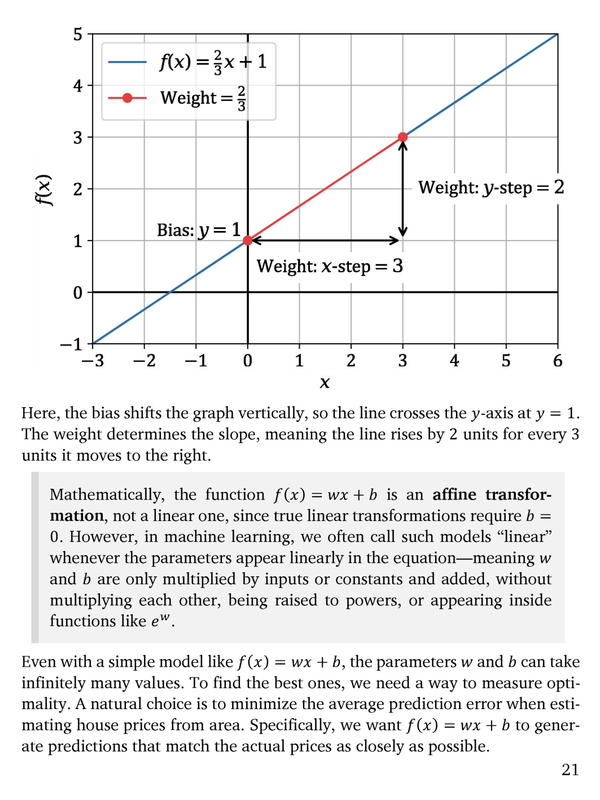

# 第 22 页

---

我来为你逐句翻译并解析这段内容，同时结合配图讲解关键概念：

---

### 配图解析
这张图直观展示了线性函数 \(f(x) = \frac{2}{3}x + 1\)：
- 蓝色直线是函数图像，它在y轴上的截距为1（对应`Bias: y = 1`）。
- 红色线段解释了权重的含义：当x轴移动3个单位（`x-step=3`），y轴上升2个单位（`y-step=2`），所以斜率（权重）为 \(\frac{2}{3}\)。

---

### 1. Here, the bias shifts the graph vertically, so the line crosses the y-axis at \(y = 1\).
**翻译**：这里，偏置项（bias）让图像发生了垂直平移，因此直线与y轴的交点在 \(y=1\) 处。
**解析**：偏置 \(b\) 的作用就是控制直线在y轴上的截距，让模型能适应非原点的分布。

### 2. The weight determines the slope, meaning the line rises by 2 units for every 3 units it moves to the right.
**翻译**：权重（weight）决定了直线的斜率，这意味着每当直线在x轴上向右移动3个单位，它在y轴上就会上升2个单位。
**解析**：权重 \(w\) 就是直线的斜率，代表了输入x每变化1个单位，输出y的变化量。

---

### 3. Mathematically, the function \(f(x) = wx + b\) is an affine transformation, not a linear one, since true linear transformations require \(b = 0\).
**翻译**：从严格的数学定义来说，函数 \(f(x) = wx + b\) 是一个**仿射变换（affine transformation）**，而非线性变换，因为真正的线性变换要求 \(b=0\)。
**解析**：纯数学中的线性变换必须满足“可加性”和“齐次性”，且必须过原点（\(b=0\)）。加入偏置 \(b\) 后，它就变成了仿射变换。

### 4. However, in machine learning, we often call such models “linear” whenever the parameters appear linearly in the equation—meaning \(w\) and \(b\) are only multiplied by inputs or constants and added, without multiplying each other, being raised to powers, or appearing inside functions like \(e^w\).
**翻译**：但在机器学习领域，只要参数在方程中以**线性形式出现**，我们通常就称这类模型为“线性模型”——即 \(w\) 和 \(b\) 只与输入或常数相乘并相加，而不互相相乘、不被取幂，也不出现在 \(e^w\) 这类函数内部。
**解析**：这是机器学习中的术语约定，它更关注参数的形式而非严格的数学定义。只要模型对参数是线性的，就被称为线性模型。

---

### 5. Even with a simple model like \(f(x) = wx + b\), the parameters \(w\) and \(b\) can take infinitely many values.
**翻译**：即使是 \(f(x) = wx + b\) 这样简单的模型，参数 \(w\) 和 \(b\) 也可以取无穷多组值。
**解析**：这引出了机器学习的核心问题：如何从无穷多组参数中，找到一组最优的参数。

### 6. To find the best ones, we need a way to measure optimality.
**翻译**：要找到最优的参数，我们需要一种衡量“最优性”的方法。
**解析**：这就是损失函数（Loss Function）的作用，它定义了什么是“好的模型”。

### 7. A natural choice is to minimize the average prediction error when estimating house prices from area.
**翻译**：一个自然的选择是，在根据面积估算房价时，最小化平均预测误差。
**解析**：对于回归任务，我们的目标是让模型的预测值与真实值的差距尽可能小。

### 8. Specifically, we want \(f(x) = wx + b\) to generate predictions that match the actual prices as closely as possible.
**翻译**：具体来说，我们希望 \(f(x) = wx + b\) 生成的预测值与真实房价尽可能接近。
**解析**：这就是回归任务的目标：通过调整 \(w\) 和 \(b\)，让直线尽可能拟合所有数据点。

---

💡 核心概念速记
| 术语 | 作用 |
| :--- | :--- |
| **Bias (\(b\))** | 控制直线在y轴上的截距，进行垂直平移 |
| **Weight (\(w\))** | 控制直线的斜率，代表输入对输出的影响强度 |
| **Affine Transformation** | 仿射变换，即带偏置的线性变换 |
| **Linear Model (ML定义)** | 参数以线性形式出现的模型，不要求必须过原点 |

---

要不要我帮你把这个线性模型的损失函数和梯度下降优化过程，也拆解成通俗易懂的步骤？

---

 | [[page_021|« 上一页]] | [[../README|📖 回到书页]] | [[page_023|下一页 »]]
