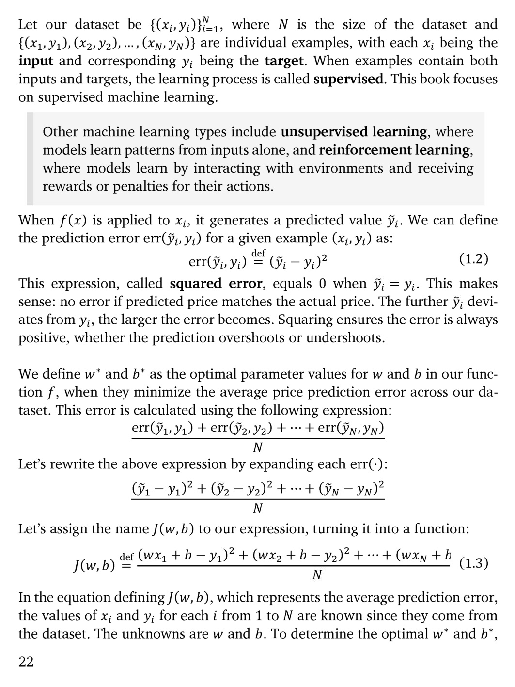

# 第 23 页

---

我来为你逐句翻译并解析这段内容：

---

### 1. 数据集与监督学习定义
> Let our dataset be \(\{(x_i, y_i)\}_{i=1}^N\), where \(N\) is the size of the dataset and \(\{(x_1,y_1),(x_2,y_2),...,(x_N,y_N)\}\) are individual examples, with each \(x_i\) being the input and corresponding \(y_i\) being the **target**. When examples contain both inputs and targets, the learning process is called **supervised**. This book focuses on supervised machine learning.

**翻译：**
设我们的数据集为 \(\{(x_i, y_i)\}_{i=1}^N\)，其中 \(N\) 是数据集的大小，\(\{(x_1,y_1),(x_2,y_2),...,(x_N,y_N)\}\) 是单个样本。每个 \(x_i\) 是输入，对应的 \(y_i\) 是**目标值（target）**。当样本同时包含输入和目标值时，这种学习过程被称为**监督学习（supervised learning）**。本书主要聚焦监督机器学习。

**解析：**
- 这是监督学习的标准定义：模型通过学习输入与目标值之间的映射关系来进行预测。
- \(x_i\) 是模型的输入特征，\(y_i\) 是我们希望模型预测的真实标签。

---

### 2. 其他机器学习范式补充
> Other machine learning types include **unsupervised learning**, where models learn patterns from inputs alone, and **reinforcement learning**, where models learn by interacting with environments and receiving rewards or penalties for their actions.

**翻译：**
其他机器学习类型包括**无监督学习（unsupervised learning）**和**强化学习（reinforcement learning）**。无监督学习中，模型仅从输入数据中学习模式；强化学习中，模型通过与环境交互，并根据其行为获得奖励或惩罚来学习。

**解析：**
- 这是机器学习三大范式的补充说明：监督学习（有标签）、无监督学习（无标签）、强化学习（通过交互和反馈学习）。

---

### 3. 预测误差与平方误差定义
> When \(f(x)\) is applied to \(x_i\), it generates a predicted value \(\tilde{y}_i\). We can define the prediction error \(\text{err}(\tilde{y}_i, y_i)\) for a given example \((x_i, y_i)\) as:
> \[
> \text{err}(\tilde{y}_i, y_i) \stackrel{\text{def}}{=} (\tilde{y}_i - y_i)^2 \tag{1.2}
> \]

**翻译：**
当函数 \(f(x)\) 作用于 \(x_i\) 时，会生成预测值 \(\tilde{y}_i\)。我们可以为给定样本 \((x_i, y_i)\) 定义预测误差 \(\text{err}(\tilde{y}_i, y_i)\) 为：
\[
\text{err}(\tilde{y}_i, y_i) \stackrel{\text{def}}{=} (\tilde{y}_i - y_i)^2 \tag{1.2}
\]

**解析：**
- 这里引入了**平方误差（squared error）**，这是回归任务中最常用的误差度量方式。
- 它衡量的是单个样本预测值与真实值之间的差距。

> This expression, called **squared error**, equals 0 when \(\tilde{y}_i = y_i\). This makes sense: no error if predicted price matches the actual price. The further \(\tilde{y}_i\) deviates from \(y_i\), the larger the error becomes. Squaring ensures the error is always positive, whether the prediction overshoots or undershoots.

**翻译：**
这个表达式被称为**平方误差**，当 \(\tilde{y}_i = y_i\) 时，误差为0。这很合理：如果预测价格与实际价格完全一致，误差就为0。\(\tilde{y}_i\) 与 \(y_i\) 的偏差越大，误差就越大。平方运算保证了无论预测值是高于还是低于真实值，误差始终为正数。

**解析：**
- 平方误差的优点：
  1. 非负性：误差不会因为正负偏差相互抵消。
  2. 放大大误差：偏差越大，惩罚越重，引导模型更关注大的预测错误。

---

### 4. 最优参数与平均误差（损失函数）
> We define \(w^*\) and \(b^*\) as the optimal parameter values for \(w\) and \(b\) in our function \(f\), when they minimize the average price prediction error across our dataset. This error is calculated using the following expression:
> \[
> \frac{\text{err}(\tilde{y}_1, y_1) + \text{err}(\tilde{y}_2, y_2) + \dots + \text{err}(\tilde{y}_N, y_N)}{N}
> \]

**翻译：**
我们将使函数 \(f\) 在整个数据集上的平均房价预测误差最小化的参数值 \(w\) 和 \(b\) 定义为最优参数 \(w^*\) 和 \(b^*\)。这个误差由以下公式计算：
\[
\frac{\text{err}(\tilde{y}_1, y_1) + \text{err}(\tilde{y}_2, y_2) + \dots + \text{err}(\tilde{y}_N, y_N)}{N}
\]

**解析：**
- 模型训练的目标就是找到一组最优参数 \(w^*\) 和 \(b^*\)，让模型在整个数据集上的平均误差最小。
- 这就是**均方误差（MSE, Mean Squared Error）**的雏形。

> Let’s rewrite the above expression by expanding each \(\text{err}(\cdot)\):
> \[
> \frac{(\tilde{y}_1 - y_1)^2 + (\tilde{y}_2 - y_2)^2 + \dots + (\tilde{y}_N - y_N)^2}{N}
> \]

**翻译：**
我们可以展开每个误差项，将上式重写为：
\[
\frac{(\tilde{y}_1 - y_1)^2 + (\tilde{y}_2 - y_2)^2 + \dots + (\tilde{y}_N - y_N)^2}{N}
\]

> Let’s assign the name \(J(w, b)\) to our expression, turning it into a function:
> \[
> J(w, b) \stackrel{\text{def}}{=} \frac{(wx_1 + b - y_1)^2 + (wx_2 + b - y_2)^2 + \dots + (wx_N + b - y_N)^2}{N} \tag{1.3}
> \]

**翻译：**
我们将这个表达式命名为 \(J(w, b)\)，将其定义为一个函数：
\[
J(w, b) \stackrel{\text{def}}{=} \frac{(wx_1 + b - y_1)^2 + (wx_2 + b - y_2)^2 + \dots + (wx_N + b - y_N)^2}{N} \tag{1.3}
\]

**解析：**
- \(J(w, b)\) 就是我们的**损失函数（loss function）**，也叫目标函数。
- 它是一个关于参数 \(w\) 和 \(b\) 的函数，我们的目标就是找到让 \(J(w, b)\) 取最小值的 \(w^*\) 和 \(b^*\)。

> In the equation defining \(J(w, b)\), which represents the average prediction error, the values of \(x_i\) and \(y_i\) for each \(i\) from 1 to \(N\) are known since they come from the dataset. The unknowns are \(w\) and \(b\). To determine the optimal \(w^*\) and \(b^*\),

**翻译：**
在定义平均预测误差的 \(J(w, b)\) 方程中，从1到N的每个 \(x_i\) 和 \(y_i\) 都是已知的，因为它们来自数据集。未知的是 \(w\) 和 \(b\)。为了确定最优的 \(w^*\) 和 \(b^*\)，（下文继续）

---

### 💡 核心知识点速记
| 术语 | 定义 |
| :--- | :--- |
| Supervised Learning | 监督学习，从带标签的 \((x_i, y_i)\) 数据中学习映射关系 |
| Squared Error | 平方误差，单个样本的误差度量：\((\tilde{y}_i - y_i)^2\) |
| Mean Squared Error (MSE) | 均方误差，整个数据集的平均误差，即损失函数 \(J(w, b)\) |
| \(J(w, b)\) | 损失函数，目标是通过优化 \(w\) 和 \(b\) 使其最小化 |
| Optimal Parameters \(w^*, b^*\) | 使损失函数 \(J(w, b)\) 取得最小值的参数 |

---

要不要我帮你把下一部分如何求解 \(w^*\) 和 \(b^*\) 的解析解，也完整拆解出来？

---

 | [[page_022|« 上一页]] | [[../README|📖 回到书页]] | [[page_024|下一页 »]]
