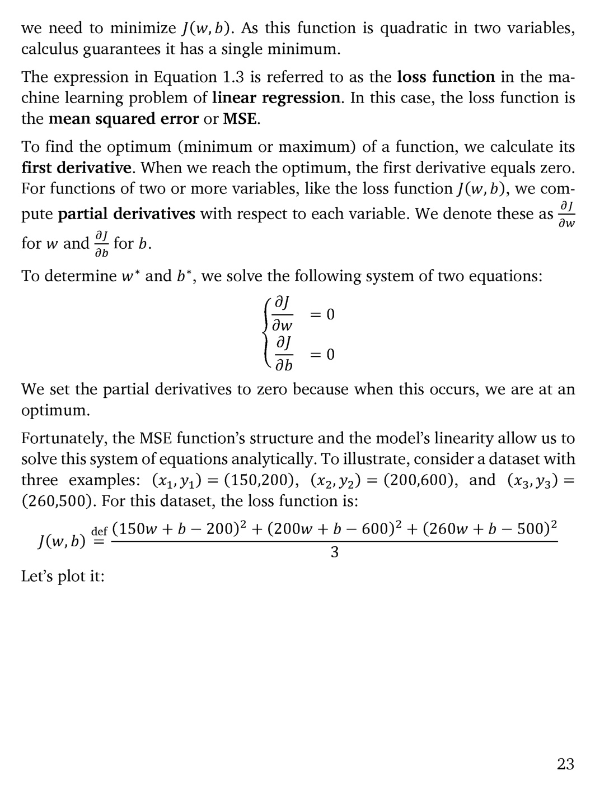

# 第 24 页

---

我来为你逐句翻译并解析这段关于线性回归损失函数与优化方法的内容：

---

### 1. 损失函数的性质
> we need to minimize \(J(w, b)\). As this function is quadratic in two variables, calculus guarantees it has a single minimum.

**翻译**：
我们需要最小化 \(J(w, b)\)。由于这个二元函数是二次的，微积分理论保证它有且仅有一个最小值点。

**解析**：
- \(J(w, b)\) 是一个关于 \(w\) 和 \(b\) 的二次函数，其图像是一个开口向上的抛物面，因此存在唯一的全局最小值，这意味着我们无需担心局部最优问题。

---

### 2. 损失函数的定义
> The expression in Equation 1.3 is referred to as the loss function in the machine learning problem of linear regression. In this case, the loss function is the mean squared error or MSE.

**翻译**：
公式1.3中的表达式，在线性回归的机器学习问题中被称为**损失函数（loss function）**。在这个场景下，该损失函数就是**均方误差（Mean Squared Error, MSE）**。

**解析**：
- 损失函数（目标函数）定义了模型的“好坏”，我们的训练目标就是最小化它。
- 均方误差（MSE）是回归任务中最经典的损失函数，它衡量了模型预测值与真实值之间的平均平方差。

---

### 3. 寻找最优解的数学方法
> To find the optimum (minimum or maximum) of a function, we calculate its first derivative. When we reach the optimum, the first derivative equals zero.

**翻译**：
要找到函数的最优值（最小值或最大值），我们需要计算它的一阶导数。当到达最优点时，一阶导数等于零。

**解析**：
- 这是微积分中寻找极值点的基本原理：函数在极值点处的切线斜率为0。

> For functions of two or more variables, like the loss function \(J(w, b)\), we compute partial derivatives with respect to each variable. We denote these as \(\frac{\partial J}{\partial w}\) for \(w\) and \(\frac{\partial J}{\partial b}\) for \(b\).

**翻译**：
对于像 \(J(w, b)\) 这样包含两个或更多变量的函数，我们需要计算对每个变量的**偏导数（partial derivatives）**。我们将对 \(w\) 的偏导数记作 \(\frac{\partial J}{\partial w}\)，对 \(b\) 的偏导数记作 \(\frac{\partial J}{\partial b}\)。

**解析**：
- 偏导数是多元函数的导数，它衡量了函数值随其中一个变量变化的速率。

> To determine \(w^*\) and \(b^*\), we solve the following system of two equations:
> \[
> \begin{cases}
> \frac{\partial J}{\partial w} = 0 \\
> \frac{\partial J}{\partial b} = 0
> \end{cases}
> \]

**翻译**：
为了确定最优参数 \(w^*\) 和 \(b^*\)，我们需要求解以下方程组：
\[
\begin{cases}
\frac{\partial J}{\partial w} = 0 \\
\frac{\partial J}{\partial b} = 0
\end{cases}
\]

> We set the partial derivatives to zero because when this occurs, we are at an optimum.

**翻译**：
我们将偏导数设为零，因为此时我们就处于函数的最优点。

---

### 4. 解析解的存在性与示例
> Fortunately, the MSE function’s structure and the model’s linearity allow us to solve this system of equations analytically.

**翻译**：
幸运的是，均方误差（MSE）函数的结构和模型的线性性，允许我们通过解析方法求解这个方程组。

**解析**：
- 这是线性回归的一大优势：存在闭式解（解析解），无需迭代优化即可直接计算出最优的 \(w^*\) 和 \(b^*\)。

> To illustrate, consider a dataset with three examples: \((x_1, y_1) = (150, 200)\), \((x_2, y_2) = (200, 600)\), and \((x_3, y_3) = (260, 500)\). For this dataset, the loss function is:
> \[
> J(w, b) \stackrel{\text{def}}{=} \frac{(150w + b - 200)^2 + (200w + b - 600)^2 + (260w + b - 500)^2}{3}
> \]

**翻译**：
为了说明这一点，我们来看一个包含三个样本的数据集：\((x_1, y_1) = (150, 200)\)、\((x_2, y_2) = (200, 600)\) 和 \((x_3, y_3) = (260, 500)\)。对于这个数据集，其损失函数为：
\[
J(w, b) \stackrel{\text{def}}{=} \frac{(150w + b - 200)^2 + (200w + b - 600)^2 + (260w + b - 500)^2}{3}
\]

> Let’s plot it:

**翻译**：
让我们把它画出来看看：

---

### 💡 核心知识点速记
| 术语 | 定义 |
| :--- | :--- |
| **Loss Function \(J(w, b)\)** | 衡量模型预测误差的函数，我们的目标是最小化它 |
| **Mean Squared Error (MSE)** | 均方误差，线性回归任务的标准损失函数 |
| **Partial Derivatives** | 偏导数，多元函数对单个变量的导数，用于寻找极值点 |
| **Analytical Solution** | 解析解，线性回归可以直接通过解方程组求出最优参数 |

---

要不要我帮你把这个例子的方程组展开，一步步推导出最优参数 \(w^*\) 和 \(b^*\) 的值？

---

 | [[page_023|« 上一页]] | [[../README|📖 回到书页]] | [[page_025|下一页 »]]
