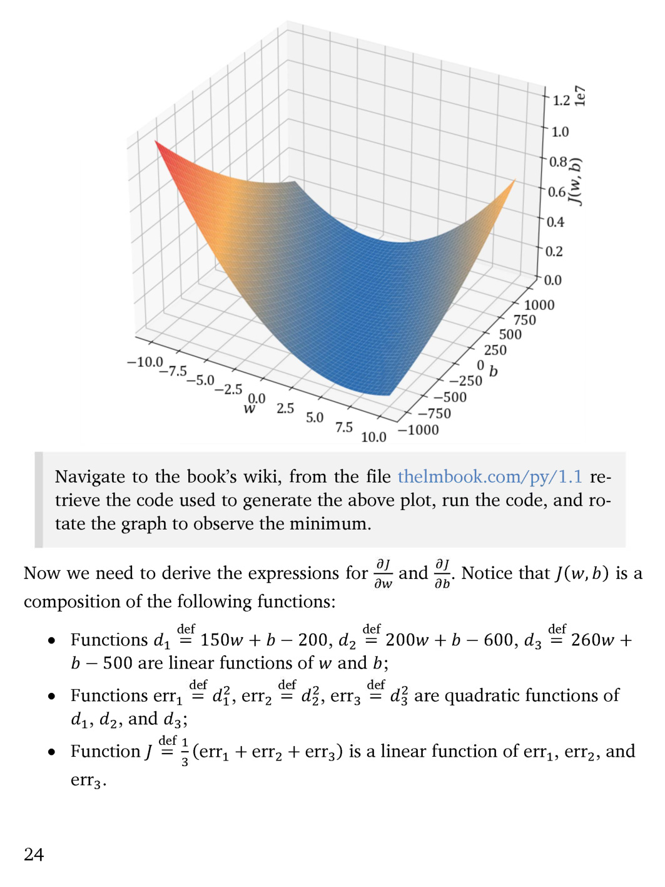

# 第 25 页

---

## 💡解答
# 逐句翻译+详细解析
## 一、3D图像部分
这是损失函数$J(w,b)$的三维抛物面图像：
- 横轴分别是参数$w$、参数$b$，竖轴是损失值$J(w,b)$；
- 曲面整体开口向上，底部唯一的最低点就是能让预测误差最小的最优参数$(w^*,b^*)$，印证了之前提到的“二元二次损失函数有唯一全局最小值”的结论。

---

## 二、灰色提示框内容
**原文**：Navigate to the book’s wiki, from the file thelmbook.com/py/1.1 retrieve the code used to generate the above plot, run the code, and rotate the graph to observe the minimum.
**翻译**：你可以访问本书的维基页面，从网址`thelmbook.com/py/1.1`获取绘制上图所用的代码，运行代码并旋转图像，直观观察最小值的位置。
**解析**：这是实操引导，读者可以通过运行代码交互式查看损失曲面，更清晰地定位全局最优点。

---

## 三、求偏导推导前置说明
### 1. 总起句
**原文**：Now we need to derive the expressions for $\frac{\partial J}{\partial w}$ and $\frac{\partial J}{\partial b}$. Notice that $J(w,b)$ is a composition of the following functions:
**翻译**：现在我们需要推导$\frac{\partial J}{\partial w}$（对$w$的偏导数）和$\frac{\partial J}{\partial b}$（对$b$的偏导数）的表达式。要注意$J(w,b)$是由以下多层函数复合而成的：
**解析**：要用链式法则求多元复合函数的偏导，所以先把损失函数拆解成多层简单函数。

### 2. 第一层拆解（残差线性函数）
**原文**：- Functions $d_1 \stackrel{\text{def}}{=} 150w + b - 200,\ d_2 \stackrel{\text{def}}{=} 200w + b - 600,\ d_3 \stackrel{\text{def}}{=} 260w + b - 500$ are linear functions of $w$ and $b$;
**翻译**：- 定义$d_1 \stackrel{\text{def}}{=} 150w + b - 200$、$d_2 \stackrel{\text{def}}{=} 200w + b - 600$、$d_3 \stackrel{\text{def}}{=} 260w + b - 500$，这三个是关于$w$和$b$的线性函数，代表单个样本的预测残差（预测值减真实值）；
**解析**：$d_i = wx_i+b-y_i$，也就是模型预测值和真实房价的差值。

### 3. 第二层拆解（单样本平方误差）
**原文**：- Functions $\text{err}_1 \stackrel{\text{def}}{=} d_1^2,\ \text{err}_2 \stackrel{\text{def}}{=} d_2^2,\ \text{err}_3 \stackrel{\text{def}}{=} d_3^2$ are quadratic functions of $d_1,d_2,$ and $d_3$;
**翻译**：- 定义$\text{err}_1 \stackrel{\text{def}}{=} d_1^2$、$\text{err}_2 \stackrel{\text{def}}{=} d_2^2$、$\text{err}_3 \stackrel{\text{def}}{=} d_3^2$，这三个是关于$d_1,d_2,d_3$的二次函数，即单个样本的平方误差；
**解析**：把残差做平方运算，消除正负偏差的抵消效果，放大大误差的惩罚力度。

### 4. 第三层拆解（整体均方误差损失）
**原文**：- Function $J \stackrel{\text{def}}{=} \frac{1}{3}(\text{err}_1 + \text{err}_2 + \text{err}_3)$ is a linear function of $\text{err}_1,\text{err}_2,$ and $\text{err}_3$.
**翻译**：- 定义$J \stackrel{\text{def}}{=} \frac{1}{3}(\text{err}_1 + \text{err}_2 + \text{err}_3)$，这个函数是关于$\text{err}_1,\text{err}_2,\text{err}_3$的线性函数，也就是三个样本的平均平方误差；
**解析**：对所有单样本误差取平均值，得到最终要优化的MSE损失函数，三层结构可以用链式法则逐层求偏导。

---

## 核心知识点总结
1. 线性回归的MSE损失是**凸二次函数**，三维曲面只有一个全局最低点，优化不会陷入局部最优；
2. 复合函数分层拆解是为了用**链式法则**计算偏导数，后续令偏导数为0就能解出最优$w^*,b^*$；
3. $\stackrel{\text{def}}{=}$符号代表“根据定义等于”，用来明确变量的定义式。

要不要我顺着这个分层结构，完整演算一遍$\frac{\partial J}{\partial w}$和$\frac{\partial J}{\partial b}$的推导全过程？

---

 | [[page_024|« 上一页]] | [[../README|📖 回到书页]] | [[page_026|下一页 »]]
